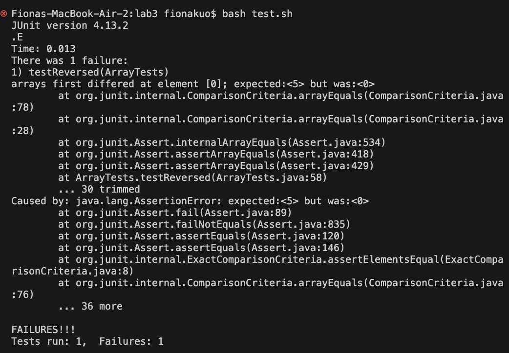

# Lab Report 3 - Bugs and Commands (Week 5)
## Part 1 - Bugs

- A failure-inducing input for the buggy program, as a JUnit test and any associated code (write it as a code block in Markdown)

```
# This code shows a failure-inducing output says: expected:<5> but was:<0>.
import static org.junit.Assert.*;
import org.junit.*;

public class ArrayTests {
  @Test
  public void testReversed() {
    int[] input2 = { 2,3,4,5 };
    assertArrayEquals(new int[]{ 5,4,3,2 }, ArrayExamples.reversed(input2));
  }
}
```

- An input that doesn’t induce a failure, as a JUnit test and any associated code (write it as a code block in Markdown)

```
# This code's output doesn’t induce a failure message.
import static org.junit.Assert.*;
import org.junit.*;

public class ArrayTests {
  @Test
  public void testReversed() {
    int[] input2 = { };
    assertArrayEquals(new int[]{ }, ArrayExamples.reversed(input2));
  }
}
```

- The symptom, as the output of running the tests (provide it as a screenshot of running JUnit with at least the two inputs above)
  - A failure-inducing output message:

  - An output that doesn’t induce a failure message:


- The bug, as the before-and-after code change required to fix it (as two code blocks in Markdown)

```
# Before fixing:
public class ArrayExamples {
  // Returns a *new* array with all the elements of the input array in reversed order
  static int[] reversed(int[] arr) {
    int[] newArray = new int[arr.length];
    for(int i = 0; i < arr.length; i += 1) {
      arr[i] = newArray[arr.length - i - 1];
    }
    return arr;
  }
}

```

```
# After fixing:
public class ArrayExamples {
  // Returns a *new* array with all the elements of the input array in reversed order
  static int[] reversed(int[] arr) {
    int[] newArray = new int[arr.length];
    for(int i = 0; i < arr.length; i += 1) {
      newArray[i] = arr[arr.length - i - 1];
    }
    return newArray;
  }
}
```
- Briefly describe why the fix addresses the issue:
  - I fixed the code from `arr[i] = newArray[arr.length - i - 1];` to `newArray[i] = arr[arr.length - i - 1];`.
Initially the code was `arr[i] = newArray[arr.length - i - 1];`,
which means the code was appending `newArray[arr.length - i - 1];`(empty array) to `arr[i]`,
that was why we received an error message indicating that we got `<0>` instead of `<5>`.
The goal for this function is to returns a new array with all the elements of the input array in reversed order,
so the elements should be appending reversely from input array(arr) to the new array(newArray), which indicates `newArray[i] = arr[arr.length - i - 1];`.

## Part 2 - Researching Commands
- Chosen command is `find`.
- The four command-line options are `-type`, `-name`, `-print`, and `-iname`.

- `find ./technical -type f`
  
```
# This finds all the paths to each files within ./technical directory.
# This can be useful when we try to find all the paths to each files.
./technical/plos/journal.pbio.0020042.txt
./technical/plos/journal.pbio.0020297.txt
./technical/plos/pmed.0020206.txt
./technical/plos/pmed.0020212.txt
./technical/plos/pmed.0020216.txt
./technical/plos/journal.pbio.0030094.txt
./technical/plos/journal.pbio.0020046.txt
./technical/plos/pmed.0020028.txt
./technical/plos/journal.pbio.0020052.txt
./technical/plos/pmed.0020148.txt
./technical/plos/pmed.0020160.txt
./technical/plos/pmed.0010048.txt
./technical/plos/pmed.0010060.txt
./technical/plos/journal.pbio.0030137.txt
./technical/plos/journal.pbio.0030136.txt
./technical/plos/pmed.0010061.txt
./technical/plos/pmed.0010049.txt
./technical/plos/pmed.0020161.txt
./technical/plos/journal.pbio.0020127.txt
./technical/plos/pmed.0020149.txt
./technical/plos/journal.pbio.0020133.txt
./technical/plos/pmed.0020015.txt
./technical/plos/journal.pbio.0020053.txt
./technical/plos/journal.pbio.0020047.txt
./technical/plos/pmed.0020203.txt
./technical/plos/journal.pbio.0030056.txt
./technical/plos/pmed.0020201.txt
./technical/plos/journal.pbio.0030097.txt
./technical/plos/pmed.0020017.txt
./technical/plos/journal.pbio.0020125.txt
./technical/plos/journal.pbio.0020440.txt
./technical/plos/pmed.0010062.txt
./technical/plos/pmed.0020189.txt
./technical/plos/pmed.0020162.txt
./technical/plos/pmed.0020016.txt
./technical/plos/pmed.0020002.txt
./technical/plos/pmed.0020200.txt
./technical/plos/pmed.0020231.txt
./technical/plos/journal.pbio.0020263.txt
./technical/plos/pmed.0020027.txt
./technical/plos/pmed.0020033.txt
./technical/plos/journal.pbio.0020101.txt
./technical/plos/pmed.0010047.txt
./technical/plos/journal.pbio.0030105.txt
./technical/plos/journal.pbio.0020302.txt
./technical/plos/pmed.0010046.txt
./technical/plos/pmed.0010052.txt
./technical/plos/pmed.0020191.txt
./technical/plos/journal.pbio.0020100.txt
./technical/plos/pmed.0020146.txt
./technical/plos/journal.pbio.0020262.txt
./technical/plos/journal.pbio.0030065.txt
./technical/plos/journal.pbio.0020276.txt
./technical/plos/pmed.0020232.txt
./technical/plos/pmed.0020226.txt
./technical/plos/pmed.0020024.txt
./technical/plos/pmed.0020018.txt
./technical/plos/pmed.0020144.txt
./technical/plos/pmed.0020150.txt
./technical/plos/journal.pbio.0020116.txt
./technical/plos/pmed.0020187.txt
./technical/plos/pmed.0010050.txt
./technical/plos/pmed.0010051.txt
./technical/plos/pmed.0020192.txt
./technical/plos/pmed.0010045.txt
./technical/plos/pmed.0020145.txt
./technical/plos/pmed.0020019.txt
./technical/plos/journal.pbio.0020063.txt
./technical/plos/journal.pbio.0030076.txt
./technical/plos/journal.pbio.0030062.txt
./technical/plos/pmed.0020237.txt
./technical/plos/journal.pbio.0020067.txt
./technical/plos/pmed.0020009.txt
./technical/plos/journal.pbio.0020073.txt
./technical/plos/pmed.0020035.txt
./technical/plos/pmed.0020021.txt
./technical/plos/journal.pbio.0020113.txt
./technical/plos/pmed.0020155.txt
./technical/plos/pmed.0010069.txt
./technical/plos/pmed.0010041.txt
./technical/plos/pmed.0020182.txt
./technical/plos/pmed.0020196.txt
./technical/plos/journal.pbio.0020311.txt
./technical/plos/journal.pbio.0030102.txt
./technical/plos/journal.pbio.0020310.txt
./technical/plos/pmed.0020197.txt
./technical/plos/pmed.0010068.txt
./technical/plos/pmed.0020140.txt
./technical/plos/journal.pbio.0020112.txt
./technical/plos/pmed.0020020.txt
./technical/plos/pmed.0020034.txt
./technical/plos/pmed.0020236.txt
./technical/plos/journal.pbio.0020272.txt
./technical/plos/pmed.0020208.txt
./technical/plos/journal.pbio.0020064.txt
./technical/plos/pmed.0020022.txt
./technical/plos/pmed.0020036.txt
./technical/plos/pmed.0010056.txt
./technical/plos/pmed.0020195.txt
./technical/plos/pmed.0010042.txt
./technical/plos/pmed.0020181.txt
./technical/plos/journal.pbio.0020306.txt
./technical/plos/journal.pbio.0030129.txt
./technical/plos/journal.pbio.0020307.txt
./technical/plos/pmed.0020180.txt
./technical/plos/pmed.0020194.txt
./technical/plos/pmed.0020157.txt
./technical/plos/journal.pbio.0020105.txt
./technical/plos/pmed.0020023.txt
./technical/plos/journal.pbio.0020071.txt
./technical/plos/pmed.0020235.txt
./technical/plos/journal.pbio.0020267.txt
./technical/plos/pmed.0020209.txt
./technical/plos/pmed.0020246.txt
./technical/plos/journal.pbio.0020228.txt
./technical/plos/journal.pbio.0020214.txt
./technical/plos/pmed.0020050.txt
./technical/plos/pmed.0020118.txt
./technical/plos/pmed.0010030.txt
./technical/plos/pmed.0010024.txt
./technical/plos/journal.pbio.0020348.txt
./technical/plos/journal.pbio.0020406.txt
./technical/plos/pmed.0010025.txt
./technical/plos/pmed.0020086.txt
./technical/plos/pmed.0020045.txt
./technical/plos/journal.pbio.0020215.txt
./technical/plos/pmed.0020247.txt
./technical/plos/pmed.0020047.txt
./technical/plos/journal.pbio.0020001.txt
./technical/plos/pmed.0020090.txt
./technical/plos/journal.pbio.0020161.txt
./technical/plos/journal.pbio.0020439.txt
./technical/plos/journal.pbio.0020404.txt
./technical/plos/pmed.0010026.txt
./technical/plos/journal.pbio.0020148.txt
./technical/plos/pmed.0020085.txt
./technical/plos/pmed.0020091.txt
./technical/plos/journal.pbio.0020028.txt
./technical/plos/journal.pbio.0020216.txt
./technical/plos/pmed.0020278.txt
./technical/plos/pmed.0020268.txt
./technical/plos/journal.pbio.0020206.txt
./technical/plos/journal.pbio.0020010.txt
./technical/plos/journal.pbio.0020164.txt
./technical/plos/pmed.0010022.txt
./technical/plos/pmed.0010036.txt
./technical/plos/journal.pbio.0020400.txt
./technical/plos/journal.pbio.0020401.txt
./technical/plos/pmed.0010023.txt
./technical/plos/pmed.0020123.txt
./technical/plos/pmed.0020094.txt
./technical/plos/journal.pbio.0020213.txt
./technical/plos/pmed.0020257.txt
./technical/plos/journal.pbio.0020013.txt
./technical/plos/pmed.0020055.txt
./technical/plos/pmed.0020082.txt
./technical/plos/pmed.0010021.txt
./technical/plos/pmed.0010034.txt
./technical/plos/pmed.0010008.txt
./technical/plos/pmed.0020120.txt
./technical/plos/journal.pbio.0020172.txt
./technical/plos/pmed.0020040.txt
./technical/plos/pmed.0020068.txt
./technical/plos/journal.pbio.0020012.txt
./technical/plos/pmed.0020281.txt
./technical/plos/pmed.0020242.txt
./technical/biomed/1472-6807-2-2.txt
./technical/biomed/1471-2350-4-3.txt
./technical/biomed/1471-2156-2-3.txt
./technical/biomed/1471-2156-3-11.txt
./technical/biomed/1471-2121-3-10.txt
./technical/biomed/1471-2172-3-4.txt
./technical/biomed/gb-2002-4-1-r2.txt
./technical/biomed/gb-2003-4-6-r41.txt
./technical/biomed/1471-2466-1-1.txt
./technical/biomed/1471-2199-2-10.txt
./technical/biomed/1471-2202-2-9.txt
./technical/biomed/cc991.txt
./technical/biomed/1471-2369-3-9.txt
./technical/biomed/bcr620.txt
./technical/biomed/1476-069X-2-4.txt
./technical/biomed/1472-6750-3-11.txt
./technical/biomed/1471-2164-2-9.txt
./technical/biomed/1471-2091-2-10.txt
./technical/biomed/gb-2001-2-4-research0010.txt
./technical/biomed/gb-2003-4-4-r24.txt
./technical/biomed/1471-213X-2-1.txt
./technical/biomed/1472-6882-3-3.txt
./technical/biomed/1471-2407-2-3.txt
./technical/biomed/ar331.txt
./technical/biomed/ar319.txt
./technical/biomed/1471-2156-4-5.txt
./technical/biomed/1471-2431-2-1.txt
./technical/biomed/1476-4598-2-22.txt
./technical/biomed/1471-2180-2-22.txt
./technical/biomed/1471-2334-3-9.txt
./technical/biomed/1471-2091-2-11.txt
./technical/biomed/gb-2001-2-4-research0011.txt
./technical/biomed/1471-2202-4-12.txt
./technical/biomed/rr73.txt
./technical/biomed/1471-2164-2-8.txt
./technical/biomed/1471-2148-2-12.txt
./technical/biomed/bcr635.txt
./technical/biomed/1468-6708-3-10.txt
./technical/biomed/gb-2003-4-5-r34.txt
./technical/biomed/1471-2202-2-8.txt
./technical/biomed/1471-2121-3-11.txt
./technical/biomed/1471-2156-3-10.txt
./technical/biomed/1471-2458-3-20.txt
./technical/biomed/1471-2350-4-2.txt
./technical/biomed/1472-6807-2-3.txt
./technical/biomed/1472-6807-2-1.txt
./technical/biomed/1476-4598-1-8.txt
./technical/biomed/1477-7525-1-9.txt
./technical/biomed/ar79.txt
./technical/biomed/1476-0711-2-7.txt
./technical/biomed/1472-6947-3-8.txt
./technical/biomed/1471-2121-3-13.txt
./technical/biomed/gb-2002-4-1-r1.txt
./technical/biomed/1471-2407-3-18.txt
./technical/biomed/1471-2229-2-3.txt
./technical/biomed/1471-2334-1-9.txt
./technical/biomed/gb-2002-3-9-research0043.txt
./technical/biomed/1471-2415-3-5.txt
./technical/biomed/1471-2334-1-21.txt
./technical/biomed/gb-2001-2-7-research0025.txt
./technical/biomed/ar130.txt
./technical/biomed/1476-069X-2-7.txt
./technical/biomed/1472-6890-2-5.txt
./technical/biomed/ar118.txt
./technical/biomed/gb-2002-3-7-research0032.txt
./technical/biomed/1471-2253-2-5.txt
./technical/biomed/1471-2210-1-10.txt
./technical/biomed/1471-2091-2-13.txt
./technical/biomed/1471-2180-2-20.txt
./technical/biomed/1471-2202-3-19.txt
./technical/biomed/1471-2202-4-10.txt
./technical/biomed/1472-6963-2-10.txt
./technical/biomed/1476-4598-2-20.txt
./technical/biomed/1471-2156-4-6.txt
./technical/biomed/1471-2458-3-5.txt
./technical/biomed/1472-6769-1-4.txt
./technical/biomed/gb-2003-4-4-r26.txt
./technical/biomed/1472-6882-3-1.txt
./technical/biomed/cc4.txt
./technical/biomed/1471-2180-2-35.txt
./technical/biomed/1471-2202-4-11.txt
./technical/biomed/gb-2001-2-4-research0012.txt
./technical/biomed/1471-2091-2-12.txt
./technical/biomed/1471-2253-2-4.txt
./technical/biomed/gb-2001-2-7-research0024.txt
./technical/biomed/1471-2415-3-4.txt
./technical/biomed/1471-2199-2-12.txt
./technical/biomed/1471-2121-3-12.txt
./technical/biomed/1471-2148-1-8.txt
./technical/biomed/gb-2001-2-3-research0008.txt
./technical/biomed/1471-2156-2-1.txt
./technical/biomed/1471-2466-3-1.txt
./technical/biomed/bcr568.txt
./technical/biomed/gb-2003-4-7-r46.txt
./technical/biomed/1475-2875-2-14.txt
./technical/biomed/1471-2288-2-4.txt
./technical/biomed/1472-6785-1-3.txt
./technical/biomed/ar93.txt
./technical/biomed/1472-6831-2-2.txt
./technical/biomed/bcr583.txt
./technical/biomed/cc367.txt
./technical/biomed/1477-7827-1-17.txt
./technical/biomed/1477-7827-1-13.txt
./technical/biomed/1472-6807-2-4.txt
./technical/biomed/1471-2156-3-17.txt
./technical/biomed/1475-2875-2-10.txt
./technical/biomed/gb-2003-4-7-r42.txt
./technical/biomed/1471-2156-2-5.txt
./technical/biomed/ar68.txt
./technical/biomed/1471-2172-3-2.txt
./technical/biomed/1471-2121-3-16.txt
./technical/biomed/1472-6750-1-12.txt
./technical/biomed/1472-6904-2-7.txt
./technical/biomed/1472-6882-1-7.txt
./technical/biomed/1471-2334-1-24.txt
./technical/biomed/1471-2377-2-4.txt
./technical/biomed/gb-2002-3-9-research0046.txt
./technical/biomed/rr74.txt
./technical/biomed/gb-2002-3-7-research0037.txt
./technical/biomed/gb-2001-2-8-research0027.txt
./technical/biomed/1476-069X-2-2.txt
./technical/biomed/1471-2148-2-15.txt
./technical/biomed/1472-6874-2-1.txt
./technical/biomed/1471-2210-1-8.txt
./technical/biomed/1471-2091-3-8.txt
./technical/biomed/1472-6793-2-8.txt
./technical/biomed/1471-213X-2-7.txt
./technical/biomed/1471-2202-3-20.txt
./technical/biomed/1471-2091-2-16.txt
./technical/biomed/1476-4598-2-25.txt
./technical/biomed/1471-230X-2-21.txt
./technical/biomed/1476-4598-2-24.txt
./technical/biomed/1471-2350-2-2.txt
./technical/biomed/gb-2001-2-11-research0046.txt
./technical/biomed/1472-6769-1-1.txt
./technical/biomed/ar120.txt
./technical/biomed/1471-2148-2-14.txt
./technical/biomed/1471-2407-1-19.txt
./technical/biomed/gb-2001-2-8-research0032.txt
./technical/biomed/gb-2002-3-7-research0036.txt
./technical/biomed/1471-2415-3-1.txt
./technical/biomed/gb-2003-4-5-r32.txt
./technical/biomed/1472-6750-1-13.txt
./technical/biomed/1472-6920-1-3.txt
./technical/biomed/1471-2474-2-1.txt
./technical/biomed/1476-0711-2-3.txt
./technical/biomed/rr171.txt
./technical/biomed/1471-2156-3-16.txt
./technical/biomed/gb-2003-4-7-r43.txt
./technical/biomed/1472-6807-2-5.txt
./technical/biomed/1471-2350-4-4.txt
./technical/biomed/1471-2172-1-1.txt
./technical/biomed/ar297.txt
./technical/biomed/1471-2350-4-6.txt
./technical/biomed/rr167.txt
./technical/biomed/1471-2474-2-3.txt
./technical/biomed/1471-2121-3-15.txt
./technical/biomed/1471-2172-3-1.txt
./technical/biomed/1472-6904-2-4.txt
./technical/biomed/1472-6750-1-11.txt
./technical/biomed/gb-2003-4-5-r30.txt
./technical/biomed/gb-2002-3-9-research0051.txt
./technical/biomed/1471-2415-3-3.txt
./technical/biomed/gb-2002-3-9-research0045.txt
./technical/biomed/gb-2001-2-8-research0030.txt
./technical/biomed/bcr631.txt
./technical/biomed/1472-6769-1-3.txt
./technical/biomed/cc3.txt
./technical/biomed/1471-2180-2-32.txt
./technical/biomed/1471-2202-4-16.txt
./technical/biomed/1471-2180-2-26.txt
./technical/biomed/1471-2431-2-4.txt
./technical/biomed/1471-2458-3-2.txt
./technical/biomed/1475-9276-1-3.txt
./technical/biomed/ar321.txt
./technical/biomed/1471-230X-2-23.txt
./technical/biomed/ar309.txt
./technical/biomed/gb-2001-2-4-research0014.txt
./technical/biomed/1477-7819-1-10.txt
./technical/biomed/gb-2001-2-11-research0045.txt
./technical/biomed/1471-2202-4-17.txt
./technical/biomed/1472-6769-1-2.txt
./technical/biomed/bcr618.txt
./technical/biomed/gb-2002-3-7-research0035.txt
./technical/biomed/gb-2001-2-8-research0031.txt
./technical/biomed/1471-2148-2-17.txt
./technical/biomed/1471-2229-2-4.txt
./technical/biomed/1471-2350-3-12.txt
./technical/biomed/gb-2002-3-9-research0044.txt
./technical/biomed/1471-2377-2-6.txt
./technical/biomed/1471-2474-4-4.txt
./technical/biomed/1472-6904-2-5.txt
./technical/biomed/1472-6823-3-1.txt
./technical/biomed/1471-2474-2-2.txt
./technical/biomed/rr166.txt
./technical/biomed/rr172.txt
./technical/biomed/1471-2156-2-7.txt
./technical/biomed/1472-6785-1-5.txt
./technical/biomed/bcr284.txt
./technical/biomed/gb-2002-3-2-research0008.txt
./technical/biomed/gb-2002-3-11-research0059.txt
./technical/biomed/cc2190.txt
./technical/biomed/gb-2002-3-11-research0065.txt
./technical/biomed/1471-213X-3-2.txt
./technical/biomed/1471-2148-3-18.txt
./technical/biomed/1471-2229-3-3.txt
./technical/biomed/1471-2172-4-1.txt
./technical/biomed/ar795.txt
./technical/biomed/1471-2164-3-15.txt
./technical/biomed/cc1843.txt
./technical/biomed/1471-2164-3-29.txt
./technical/biomed/1471-2458-2-16.txt
./technical/biomed/1475-925X-2-10.txt
./technical/biomed/1472-6807-3-1.txt
./technical/biomed/gb-2003-4-9-r58.txt
./technical/biomed/1471-2105-4-27.txt
./technical/biomed/1471-2105-3-12.txt
./technical/biomed/gb-2003-4-2-r16.txt
./technical/biomed/ar408.txt
./technical/biomed/ar409.txt
./technical/biomed/1471-2407-2-11.txt
./technical/biomed/gb-2001-2-10-research0041.txt
./technical/biomed/1471-2288-3-4.txt
./technical/biomed/1471-2105-4-26.txt
./technical/biomed/1471-230X-1-5.txt
./technical/biomed/gb-2002-3-8-research0040.txt
./technical/biomed/1475-925X-2-11.txt
./technical/biomed/gb-2001-2-9-research0035.txt
./technical/biomed/1471-2172-3-12.txt
./technical/biomed/gb-2003-4-6-r37.txt
./technical/biomed/1472-6750-1-8.txt
./technical/biomed/1471-244X-2-9.txt
./technical/biomed/gb-2002-3-12-research0085.txt
./technical/biomed/1471-213X-1-1.txt
./technical/biomed/1471-2164-4-21.txt
./technical/biomed/cc1856.txt
./technical/biomed/1471-2180-3-15.txt
./technical/biomed/1471-2164-3-28.txt
./technical/biomed/cc105.txt
./technical/biomed/1471-2202-2-10.txt
./technical/biomed/1471-2180-1-8.txt
./technical/biomed/1471-2431-3-3.txt
./technical/biomed/1471-2369-3-10.txt
./technical/biomed/1471-213X-3-3.txt
./technical/biomed/cc1498.txt
./technical/biomed/1471-2377-1-2.txt
./technical/biomed/1471-2350-3-7.txt
./technical/biomed/gb-2002-3-2-research0009.txt
./technical/biomed/bcr285.txt
./technical/biomed/gb-2002-3-6-software0001.txt
./technical/biomed/1475-2867-3-12.txt
./technical/biomed/1471-2229-1-2.txt
./technical/biomed/1471-2407-3-3.txt
./technical/biomed/1472-6890-1-4.txt
./technical/biomed/1471-2172-4-2.txt
./technical/biomed/1471-2164-3-16.txt
./technical/biomed/1471-2091-3-18.txt
./technical/biomed/1471-2202-2-12.txt
./technical/biomed/1471-2164-4-23.txt
./technical/biomed/1471-213X-1-3.txt
./technical/biomed/gb-2002-3-12-research0087.txt
./technical/biomed/1471-2091-3-30.txt
./technical/biomed/gb-2002-3-12-research0078.txt
./technical/biomed/1471-2164-3-9.txt
./technical/biomed/1471-2172-3-10.txt
./technical/biomed/1471-2172-2-4.txt
./technical/biomed/1471-2180-1-12.txt
./technical/biomed/gb-2001-2-6-research0018.txt
./technical/biomed/gb-2001-2-9-research0037.txt
./technical/biomed/1471-2105-2-9.txt
./technical/biomed/1472-6904-3-1.txt
./technical/biomed/1472-6793-2-16.txt
./technical/biomed/1472-6807-3-2.txt
./technical/biomed/1476-072X-2-4.txt
./technical/biomed/1471-2121-2-18.txt
./technical/biomed/1471-2148-2-8.txt
./technical/biomed/1471-2105-4-24.txt
./technical/biomed/1471-2156-3-3.txt
./technical/biomed/1471-2466-2-3.txt
./technical/biomed/1471-230X-3-5.txt
./technical/biomed/1471-2407-2-12.txt
./technical/biomed/gb-2003-4-2-r14.txt
./technical/biomed/1472-6904-1-2.txt
./technical/biomed/cc1538.txt
./technical/biomed/1471-2105-4-25.txt
./technical/biomed/1471-2105-3-38.txt
./technical/biomed/ar422.txt
./technical/biomed/gb-2001-2-10-research0042.txt
./technical/biomed/1471-2105-4-31.txt
./technical/biomed/1472-6831-3-1.txt
./technical/biomed/ar387.txt
./technical/biomed/1471-230X-1-6.txt
./technical/biomed/1472-6793-2-17.txt
./technical/biomed/1471-2156-2-18.txt
./technical/biomed/1471-2105-2-8.txt
./technical/biomed/1475-925X-2-12.txt
./technical/biomed/1478-7954-1-3.txt
./technical/biomed/1472-6807-1-1.txt
./technical/biomed/cc1882.txt
./technical/biomed/1471-2164-3-8.txt
./technical/biomed/1471-2180-3-9.txt
./technical/biomed/gb-2002-3-12-research0079.txt
./technical/biomed/1471-2091-3-31.txt
./technical/biomed/gb-2002-3-12-research0086.txt
./technical/biomed/1471-2164-4-22.txt
./technical/biomed/1471-213X-1-2.txt
./technical/biomed/1471-2202-3-8.txt
./technical/biomed/1471-2458-2-6.txt
./technical/biomed/1477-7827-1-48.txt
./technical/biomed/1471-2229-1-3.txt
./technical/biomed/1471-213X-3-4.txt
./technical/biomed/cc300.txt
./technical/biomed/1476-069X-1-3.txt
./technical/biomed/1471-2253-1-1.txt
./technical/biomed/1471-2431-3-4.txt
./technical/biomed/1471-2210-2-9.txt
./technical/biomed/gb-2002-3-12-research0082.txt
./technical/biomed/1471-213X-1-6.txt
./technical/biomed/1471-2164-4-26.txt
./technical/biomed/1471-2164-3-13.txt
./technical/biomed/1471-2202-2-17.txt
./technical/biomed/1472-6874-3-2.txt
./technical/biomed/ar778.txt
./technical/biomed/ar750.txt
./technical/biomed/1471-2474-3-3.txt
./technical/biomed/1472-6785-2-6.txt
./technical/biomed/1471-2490-3-2.txt
./technical/biomed/1477-7827-1-9.txt
./technical/biomed/gb-2001-2-6-research0021.txt
./technical/biomed/ar624.txt
./technical/biomed/1471-2121-2-21.txt
./technical/biomed/1472-6920-2-3.txt
./technical/biomed/ar383.txt
./technical/biomed/1471-2105-3-14.txt
./technical/biomed/1471-2407-2-16.txt
./technical/biomed/1471-2105-3-28.txt
./technical/biomed/gb-2003-4-2-r11.txt
./technical/biomed/cc1529.txt
./technical/biomed/1471-2407-2-17.txt
./technical/biomed/1472-6815-2-3.txt
./technical/biomed/ar619.txt
./technical/biomed/1471-2458-2-11.txt
./technical/biomed/gb-2001-2-6-research0020.txt
./technical/biomed/1472-6785-2-7.txt
./technical/biomed/1471-2180-1-16.txt
./technical/biomed/ar745.txt
./technical/biomed/1472-6890-3-2.txt
./technical/biomed/cc103.txt
./technical/biomed/1471-2202-2-16.txt
./technical/biomed/ar792.txt
./technical/biomed/gb-2002-3-12-research0083.txt
./technical/biomed/1471-2180-3-13.txt
./technical/biomed/1471-2210-2-8.txt
./technical/biomed/1472-6793-1-8.txt
./technical/biomed/1471-2458-2-3.txt
./technical/biomed/1472-6750-2-21.txt
./technical/biomed/1471-2431-3-5.txt
./technical/biomed/1472-6882-2-10.txt
./technical/biomed/1471-2350-3-1.txt
./technical/biomed/gb-2002-3-11-research0062.txt
./technical/biomed/1472-6882-2-5.txt
./technical/biomed/gb-2002-3-11-research0060.txt
./technical/biomed/1471-213X-3-7.txt
./technical/biomed/cc303.txt
./technical/biomed/cc1477.txt
./technical/biomed/1471-2407-3-5.txt
./technical/biomed/1471-2377-3-4.txt
./technical/biomed/1471-2180-3-11.txt
./technical/biomed/gb-2002-3-12-research0081.txt
./technical/biomed/cc1852.txt
./technical/biomed/1471-2164-4-25.txt
./technical/biomed/1471-2091-3-22.txt
./technical/biomed/1471-2202-2-14.txt
./technical/biomed/1471-2164-3-10.txt
./technical/biomed/1471-2164-4-19.txt
./technical/biomed/cc713.txt
./technical/biomed/1471-2172-3-16.txt
./technical/biomed/1471-2180-1-28.txt
./technical/biomed/1471-230X-1-10.txt
./technical/biomed/1471-2121-2-22.txt
./technical/biomed/1471-2334-2-29.txt
./technical/biomed/1471-2121-3-8.txt
./technical/biomed/1472-6963-1-8.txt
./technical/biomed/1471-2296-3-19.txt
./technical/biomed/1471-2407-2-15.txt
./technical/biomed/1471-2105-3-17.txt
./technical/biomed/1471-230X-3-3.txt
./technical/biomed/ar430.txt
./technical/biomed/1471-2156-3-4.txt
./technical/biomed/1471-2466-2-4.txt
./technical/biomed/1471-2296-3-18.txt
./technical/biomed/1471-2105-3-16.txt
./technical/biomed/1472-6920-2-1.txt
./technical/biomed/1476-072X-2-3.txt
./technical/biomed/gb-2003-4-9-r60.txt
./technical/biomed/ar140.txt
./technical/biomed/gb-2003-4-3-r17.txt
./technical/biomed/1472-6793-2-11.txt
./technical/biomed/1472-6823-2-2.txt
./technical/biomed/1471-2180-1-29.txt
./technical/biomed/1471-2172-2-3.txt
./technical/biomed/1471-2407-1-6.txt
./technical/biomed/1471-2091-2-9.txt
./technical/biomed/1471-2202-2-15.txt
./technical/biomed/1471-2091-3-23.txt
./technical/biomed/1471-2164-4-24.txt
./technical/biomed/1471-213X-1-4.txt
./technical/biomed/gb-2002-3-12-research0080.txt
./technical/biomed/1471-2180-3-10.txt
./technical/biomed/cc1476.txt
./technical/biomed/1471-2407-3-4.txt
./technical/biomed/1471-2431-3-6.txt
./technical/biomed/bcr294.txt
./technical/biomed/gb-2002-3-11-research0061.txt
./technical/biomed/1477-7827-1-43.txt
./technical/biomed/1475-2832-1-1.txt
./technical/biomed/1471-2199-3-12.txt
./technical/biomed/1471-2202-1-1.txt
./technical/biomed/1472-6750-2-13.txt
./technical/biomed/cc2172.txt
./technical/biomed/1472-6793-1-6.txt
./technical/biomed/1471-2210-2-6.txt
./technical/biomed/1471-213X-1-9.txt
./technical/biomed/1471-2164-3-34.txt
./technical/biomed/1471-2164-4-15.txt
./technical/biomed/1471-2202-3-3.txt
./technical/biomed/1471-2202-2-18.txt
./technical/biomed/cc2358.txt
./technical/biomed/1472-6793-3-4.txt
./technical/biomed/gb-2002-3-12-research0072.txt
./technical/biomed/1472-6963-3-11.txt
./technical/biomed/1472-6963-3-6.txt
./technical/biomed/1476-4598-2-3.txt
./technical/biomed/1477-7827-1-6.txt
./technical/biomed/1475-4924-1-10.txt
./technical/biomed/1472-6874-2-13.txt
./technical/biomed/1471-2369-4-5.txt
./technical/biomed/1471-2121-3-4.txt
./technical/biomed/1471-2121-2-12.txt
./technical/biomed/1471-2148-2-2.txt
./technical/biomed/1475-925X-2-6.txt
./technical/biomed/1471-2148-1-14.txt
./technical/biomed/1471-2407-2-19.txt
./technical/biomed/1471-2210-2-14.txt
./technical/biomed/1475-2867-3-4.txt
./technical/biomed/ar429.txt
./technical/biomed/1471-2407-2-31.txt
./technical/biomed/1471-2105-3-26.txt
./technical/biomed/1477-7525-1-12.txt
./technical/biomed/1471-2407-2-18.txt
./technical/biomed/1471-2105-4-13.txt
./technical/biomed/gb-2003-4-1-r5.txt
./technical/biomed/1471-2334-2-24.txt
./technical/biomed/1471-2318-3-2.txt
./technical/biomed/1471-2156-2-12.txt
./technical/biomed/1471-2180-1-31.txt
./technical/biomed/1476-4598-2-2.txt
./technical/biomed/1472-684X-2-1.txt
./technical/biomed/1471-5945-3-3.txt
./technical/biomed/1472-6963-3-7.txt
./technical/biomed/1475-2891-2-1.txt
./technical/biomed/1471-2091-2-5.txt
./technical/biomed/1472-6793-3-5.txt
./technical/biomed/1475-4924-1-5.txt
./technical/biomed/1471-2202-2-19.txt
./technical/biomed/1471-2091-3-13.txt
./technical/biomed/1471-2164-4-14.txt
./technical/biomed/1471-2164-3-35.txt
./technical/biomed/1471-2164-4-28.txt
./technical/biomed/cc2167.txt
./technical/biomed/bcr273.txt
./technical/biomed/1477-7827-1-54.txt
./technical/biomed/1471-2334-2-1.txt
./technical/biomed/1471-2199-3-11.txt
./technical/biomed/1472-6750-2-10.txt
./technical/biomed/1471-2210-2-5.txt
./technical/biomed/cc2171.txt
./technical/biomed/1471-2164-3-23.txt
./technical/biomed/1471-2164-4-16.txt
./technical/biomed/ar774.txt
./technical/biomed/1476-511X-1-2.txt
./technical/biomed/1472-6963-3-12.txt
./technical/biomed/1471-2091-2-7.txt
./technical/biomed/gb-2002-3-12-research0071.txt
./technical/biomed/1471-2180-1-33.txt
./technical/biomed/gb-2000-1-1-research002.txt
./technical/biomed/gb-2001-3-1-research0005.txt
./technical/biomed/bcr45.txt
./technical/biomed/1471-2091-4-1.txt
./technical/biomed/gb-2003-4-1-r7.txt
./technical/biomed/1471-2334-2-26.txt
./technical/biomed/1471-2121-2-11.txt
./technical/biomed/1471-5945-1-3.txt
./technical/biomed/1471-2105-3-18.txt
./technical/biomed/1471-2261-3-5.txt
./technical/biomed/1471-2105-3-24.txt
./technical/biomed/1476-5918-1-2.txt
./technical/biomed/1477-7525-1-10.txt
./technical/biomed/gb-2002-3-5-research0024.txt
./technical/biomed/1471-2105-3-30.txt
./technical/biomed/1471-2407-2-33.txt
./technical/biomed/gb-2002-3-5-research0025.txt
./technical/biomed/1471-2261-3-4.txt
./technical/biomed/1471-2199-3-3.txt
./technical/biomed/1471-2121-2-10.txt
./technical/biomed/1471-2121-3-6.txt
./technical/biomed/1471-2334-2-27.txt
./technical/biomed/gb-2001-3-1-research0004.txt
./technical/biomed/1471-2105-2-1.txt
./technical/biomed/1471-2261-1-6.txt
./technical/biomed/gb-2003-4-3-r18.txt
./technical/biomed/ar615.txt
./technical/biomed/ar601.txt
./technical/biomed/1476-4598-2-1.txt
./technical/biomed/1472-684X-2-2.txt
./technical/biomed/1471-2180-1-26.txt
./technical/biomed/1471-2458-2-21.txt
./technical/biomed/1472-6793-3-6.txt
./technical/biomed/1472-6963-3-13.txt
./technical/biomed/1471-2164-3-1.txt
./technical/biomed/1471-2202-3-1.txt
./technical/biomed/1471-2210-2-4.txt
./technical/biomed/1471-2199-3-10.txt
./technical/biomed/1471-2350-2-12.txt
./technical/biomed/1471-2350-3-9.txt
./technical/biomed/1475-9268-1-1.txt
./technical/biomed/gb-2001-2-2-research0004.txt
./technical/biomed/cc2160.txt
./technical/biomed/1472-6750-3-4.txt
./technical/biomed/1471-2202-3-5.txt
./technical/biomed/1471-2164-4-13.txt
./technical/biomed/1471-2091-3-14.txt
./technical/biomed/1471-5945-2-13.txt
./technical/biomed/1471-2164-3-32.txt
./technical/biomed/1471-2164-3-26.txt
./technical/biomed/1471-2288-2-11.txt
./technical/biomed/1471-2180-3-4.txt
./technical/biomed/1472-6750-1-6.txt
./technical/biomed/gb-2003-4-6-r39.txt
./technical/biomed/1471-2458-2-25.txt
./technical/biomed/gb-2003-4-3-r20.txt
./technical/biomed/gb-2003-4-9-r57.txt
./technical/biomed/1471-2121-3-2.txt
./technical/biomed/1471-2407-2-23.txt
./technical/biomed/1471-2105-4-28.txt
./technical/biomed/1472-6947-2-7.txt
./technical/biomed/gb-2002-3-5-research0021.txt
./technical/biomed/ar407.txt
./technical/biomed/1471-2199-3-7.txt
./technical/biomed/1475-2867-3-2.txt
./technical/biomed/1475-925X-2-1.txt
./technical/biomed/1475-2867-3-3.txt
./technical/biomed/1471-2105-3-34.txt
./technical/biomed/gb-2002-3-5-research0020.txt
./technical/biomed/1471-2407-2-22.txt
./technical/biomed/1471-2121-2-15.txt
./technical/biomed/1471-2148-2-5.txt
./technical/biomed/cc1044.txt
./technical/biomed/1471-2091-4-5.txt
./technical/biomed/1471-2288-1-9.txt
./technical/biomed/rr37.txt
./technical/biomed/gb-2001-3-1-research0001.txt
./technical/biomed/1472-6963-3-1.txt
./technical/biomed/1471-2172-2-9.txt
./technical/biomed/1471-2458-2-18.txt
./technical/biomed/1471-2180-3-5.txt
./technical/biomed/1471-2288-2-10.txt
./technical/biomed/1471-2164-3-4.txt
./technical/biomed/1472-6793-3-3.txt
./technical/biomed/gb-2002-3-12-research0075.txt
./technical/biomed/1471-2164-3-27.txt
./technical/biomed/1471-2164-3-33.txt
./technical/biomed/1471-2091-3-15.txt
./technical/biomed/1471-2202-3-4.txt
./technical/biomed/1472-6750-2-14.txt
./technical/biomed/1471-2180-1-7.txt
./technical/biomed/cc1497.txt
./technical/biomed/1471-2334-2-5.txt
./technical/biomed/1471-2199-3-17.txt
./technical/biomed/1471-2350-2-11.txt
./technical/biomed/1471-2334-2-7.txt
./technical/biomed/cc1495.txt
./technical/biomed/1475-9268-1-2.txt
./technical/biomed/1477-7827-1-46.txt
./technical/biomed/1471-2091-3-17.txt
./technical/biomed/ar799.txt
./technical/biomed/1471-2164-3-19.txt
./technical/biomed/gb-2002-3-12-research0088.txt
./technical/biomed/1471-2164-3-31.txt
./technical/biomed/gb-2002-3-12-research0077.txt
./technical/biomed/1472-6963-3-14.txt
./technical/biomed/1475-2875-1-14.txt
./technical/biomed/1471-2164-3-6.txt
./technical/biomed/gb-2003-4-8-r51.txt
./technical/biomed/1475-2875-2-4.txt
./technical/biomed/1472-6963-1-11.txt
./technical/biomed/ar612.txt
./technical/biomed/1472-6793-2-19.txt
./technical/biomed/1471-230X-1-8.txt
./technical/biomed/1471-2148-2-7.txt
./technical/biomed/gb-2002-3-5-research0022.txt
./technical/biomed/1471-2288-3-9.txt
./technical/biomed/1471-2105-3-22.txt
./technical/biomed/1472-6947-2-4.txt
./technical/biomed/bcr317.txt
./technical/biomed/1475-925X-2-3.txt
./technical/biomed/bcr303.txt
./technical/biomed/1471-2105-3-23.txt
./technical/biomed/1471-2288-3-8.txt
./technical/biomed/bcr458.txt
./technical/biomed/1471-2105-3-37.txt
./technical/biomed/gb-2002-3-5-research0023.txt
./technical/biomed/1472-6793-2-18.txt
./technical/biomed/1471-2156-2-17.txt
./technical/biomed/1471-2369-4-1.txt
./technical/biomed/ar149.txt
./technical/biomed/gb-2002-3-6-research0029.txt
./technical/biomed/1471-2121-1-2.txt
./technical/biomed/1471-2180-1-34.txt
./technical/biomed/gb-2003-4-8-r50.txt
./technical/biomed/1471-2164-3-7.txt
./technical/biomed/1471-2164-3-30.txt
./technical/biomed/1471-2202-2-20.txt
./technical/biomed/1471-2164-3-24.txt
./technical/biomed/1471-2202-3-7.txt
./technical/biomed/1471-2091-3-16.txt
./technical/biomed/1471-2164-3-18.txt
./technical/biomed/1472-6750-3-6.txt
./technical/biomed/1472-6793-1-2.txt
./technical/biomed/1471-2334-2-6.txt
./technical/biomed/1471-213X-1-15.txt
./technical/biomed/cc350.txt
./technical/biomed/1471-2148-3-1.txt
./technical/biomed/bcr588.txt
./technical/biomed/1471-2199-2-2.txt
./technical/biomed/1475-2867-2-7.txt
./technical/biomed/1468-6708-3-4.txt
./technical/biomed/1471-2121-3-25.txt
./technical/biomed/1471-2334-3-12.txt
./technical/biomed/1471-2202-4-6.txt
./technical/biomed/1472-6882-1-10.txt
./technical/biomed/1471-2121-3-19.txt
./technical/biomed/1471-2164-4-6.txt
./technical/biomed/1471-2229-2-9.txt
./technical/biomed/gb-2002-3-9-research0049.txt
./technical/biomed/1471-2334-1-17.txt
./technical/biomed/1471-2180-2-1.txt
./technical/biomed/cc973.txt
./technical/biomed/1471-2210-1-7.txt
./technical/biomed/1471-2326-2-4.txt
./technical/biomed/1471-2180-2-16.txt
./technical/biomed/1471-2121-4-1.txt
./technical/biomed/1471-213X-2-8.txt
./technical/biomed/1472-6793-1-12.txt
./technical/biomed/1471-2199-4-4.txt
./technical/biomed/1471-2199-4-5.txt
./technical/biomed/1471-2369-3-1.txt
./technical/biomed/1471-2164-2-1.txt
./technical/biomed/1471-2202-2-1.txt
./technical/biomed/gb-2002-3-9-research0048.txt
./technical/biomed/1471-2229-2-8.txt
./technical/biomed/1471-2474-4-8.txt
./technical/biomed/1471-2121-3-18.txt
./technical/biomed/1472-6882-1-11.txt
./technical/biomed/1471-2334-3-13.txt
./technical/biomed/cvm-2-1-038.txt
./technical/biomed/1471-2121-3-30.txt
./technical/biomed/1471-2156-4-10.txt
./technical/biomed/1471-2199-2-3.txt
./technical/biomed/1476-4598-1-3.txt
./technical/biomed/1471-2172-2-10.txt
./technical/biomed/1471-2121-2-6.txt
./technical/biomed/1477-7827-1-21.txt
./technical/biomed/1477-7827-1-23.txt
./technical/biomed/1475-2891-1-2.txt
./technical/biomed/1468-6708-3-7.txt
./technical/biomed/1471-2199-2-1.txt
./technical/biomed/1471-2105-1-1.txt
./technical/biomed/gb-2002-3-10-research0052.txt
./technical/biomed/1471-2202-4-5.txt
./technical/biomed/1471-2334-3-11.txt
./technical/biomed/1471-2164-4-5.txt
./technical/biomed/cvm-2-6-278.txt
./technical/biomed/cvm-2-4-180.txt
./technical/biomed/1471-2105-3-3.txt
./technical/biomed/gb-2003-4-2-r9.txt
./technical/biomed/1475-2883-2-11.txt
./technical/biomed/1475-2867-2-10.txt
./technical/biomed/1471-2202-2-3.txt
./technical/biomed/bcr602.txt
./technical/biomed/1471-2180-2-2.txt
./technical/biomed/gb-2001-2-12-research0055.txt
./technical/biomed/1478-1336-1-4.txt
./technical/biomed/1472-6793-2-4.txt
./technical/biomed/1471-2210-1-4.txt
./technical/biomed/1471-2091-3-4.txt
./technical/biomed/1471-2121-4-2.txt
./technical/biomed/gb-2002-3-4-research0019.txt
./technical/biomed/1471-2202-3-10.txt
./technical/biomed/1471-2180-2-29.txt
./technical/biomed/1472-6750-2-2.txt
./technical/biomed/1476-511X-2-3.txt
./technical/biomed/cc1547.txt
./technical/biomed/1472-6793-1-11.txt
./technical/biomed/1471-2407-2-9.txt
./technical/biomed/1471-2407-2-8.txt
./technical/biomed/1476-4598-2-28.txt
./technical/biomed/1476-511X-2-2.txt
./technical/biomed/1471-2202-3-11.txt
./technical/biomed/1471-2121-4-3.txt
./technical/biomed/gb-2002-3-4-research0018.txt
./technical/biomed/1471-2261-2-11.txt
./technical/biomed/1472-6793-2-5.txt
./technical/biomed/1471-2164-2-2.txt
./technical/biomed/gb-2001-2-12-research0054.txt
./technical/biomed/ar104.txt
./technical/biomed/1471-2407-1-15.txt
./technical/biomed/1471-2202-2-2.txt
./technical/biomed/gb-2003-4-2-r8.txt
./technical/biomed/1472-6947-1-2.txt
./technical/biomed/1471-2105-3-2.txt
./technical/biomed/1471-2229-2-11.txt
./technical/biomed/1471-2164-4-4.txt
./technical/biomed/cvm-2-6-286.txt
./technical/biomed/1471-2148-1-1.txt
./technical/biomed/1471-2334-3-10.txt
./technical/biomed/1472-6882-1-12.txt
./technical/biomed/gb-2002-3-10-research0053.txt
./technical/biomed/1471-2156-2-8.txt
./technical/biomed/rr196.txt
./technical/biomed/1471-2148-3-3.txt
./technical/biomed/1472-6807-2-9.txt
./technical/biomed/1477-7827-1-36.txt
./technical/biomed/1471-2148-3-7.txt
./technical/biomed/1471-213X-1-13.txt
./technical/biomed/1471-2121-2-1.txt
./technical/biomed/gb-2002-3-3-research0012.txt
./technical/biomed/1471-2156-3-22.txt
./technical/biomed/bcr571.txt
./technical/biomed/1471-2199-2-4.txt
./technical/biomed/gb-2000-1-2-research0003.txt
./technical/biomed/1472-6955-2-1.txt
./technical/biomed/1471-2105-3-6.txt
./technical/biomed/1471-2474-3-23.txt
./technical/biomed/1472-6947-1-6.txt
./technical/biomed/1471-2407-3-14.txt
./technical/biomed/1471-2202-2-6.txt
./technical/biomed/1475-2867-2-15.txt
./technical/biomed/1472-6793-2-1.txt
./technical/biomed/gb-2002-3-8-research0039.txt
./technical/biomed/1471-2369-3-6.txt
./technical/biomed/bcr607.txt
./technical/biomed/1472-6874-2-8.txt
./technical/biomed/1471-2180-2-7.txt
./technical/biomed/1471-2164-2-6.txt
./technical/biomed/1471-2180-2-38.txt
./technical/biomed/1471-2210-3-3.txt
./technical/biomed/1471-2431-2-11.txt
./technical/biomed/1472-6793-1-15.txt
./technical/biomed/1471-2458-3-9.txt
./technical/biomed/1471-2121-4-6.txt
./technical/biomed/1471-2202-3-14.txt
./technical/biomed/1471-2164-2-7.txt
./technical/biomed/gb-2001-2-12-research0051.txt
./technical/biomed/gb-2002-3-8-research0038.txt
./technical/biomed/1471-244X-3-5.txt
./technical/biomed/1471-2202-2-7.txt
./technical/biomed/1471-2334-1-10.txt
./technical/biomed/1471-2407-3-15.txt
./technical/biomed/1471-2121-3-22.txt
./technical/biomed/1471-2334-3-15.txt
./technical/biomed/1471-2148-1-4.txt
./technical/biomed/1471-2199-2-5.txt
./technical/biomed/1468-6708-3-3.txt
./technical/biomed/bcr570.txt
./technical/biomed/gb-2002-3-10-research0056.txt
./technical/biomed/1472-6947-3-5.txt
./technical/biomed/cc343.txt
./technical/biomed/1471-213X-1-12.txt
./technical/biomed/1471-2296-3-3.txt
./technical/biomed/1477-7827-1-27.txt
./technical/biomed/1476-4598-1-5.txt
./technical/biomed/rr191.txt
./technical/biomed/1471-2148-3-4.txt
./technical/biomed/1471-2458-3-11.txt
./technical/biomed/1475-2875-1-5.txt
./technical/biomed/1477-7827-1-31.txt
./technical/biomed/1471-213X-1-10.txt
./technical/biomed/gb-2002-3-3-research0011.txt
./technical/biomed/gb-2002-3-10-research0054.txt
./technical/biomed/1468-6708-3-1.txt
./technical/biomed/1471-2148-1-6.txt
./technical/biomed/1471-2202-4-3.txt
./technical/biomed/1472-6947-1-5.txt
./technical/biomed/1471-2202-2-5.txt
./technical/biomed/1476-9433-1-2.txt
./technical/biomed/1471-2210-1-2.txt
./technical/biomed/1471-2458-1-9.txt
./technical/biomed/1472-6793-2-2.txt
./technical/biomed/gb-2001-2-12-research0053.txt
./technical/biomed/1478-1336-1-2.txt
./technical/biomed/1471-2202-3-16.txt
./technical/biomed/1471-2180-2-13.txt
./technical/biomed/1471-2121-4-4.txt
./technical/biomed/gb-2003-4-4-r28.txt
./technical/biomed/1471-230X-2-17.txt
./technical/biomed/1477-5956-1-1.txt
./technical/biomed/1471-2156-4-9.txt
./technical/biomed/1471-2431-2-12.txt
./technical/biomed/ar328.txt
./technical/biomed/1471-2210-3-1.txt
./technical/biomed/1471-2121-4-5.txt
./technical/biomed/1471-2350-2-8.txt
./technical/biomed/1471-2202-3-17.txt
./technical/biomed/1471-2407-1-13.txt
./technical/biomed/bcr605.txt
./technical/biomed/1476-069X-2-9.txt
./technical/biomed/1478-1336-1-3.txt
./technical/biomed/1471-2164-2-4.txt
./technical/biomed/1471-2210-1-3.txt
./technical/biomed/1476-9433-1-3.txt
./technical/biomed/1471-2334-1-13.txt
./technical/biomed/1471-2407-3-16.txt
./technical/biomed/1471-2164-4-2.txt
./technical/biomed/cvm-2-4-187.txt
./technical/biomed/1471-2105-3-4.txt
./technical/biomed/1471-2121-3-21.txt
./technical/biomed/1471-2202-4-2.txt
./technical/biomed/1471-2172-3-9.txt
./technical/biomed/gb-2001-2-3-research0007.txt
./technical/biomed/1471-2199-2-6.txt
./technical/biomed/bcr567.txt
./technical/biomed/gb-2002-3-10-research0055.txt
./technical/biomed/1471-2121-2-3.txt
./technical/biomed/1471-213X-1-11.txt
./technical/biomed/1472-684X-1-5.txt
./technical/biomed/1476-4598-1-6.txt
./technical/911report/chapter-13.4.txt
./technical/911report/chapter-13.5.txt
./technical/911report/chapter-13.1.txt
./technical/911report/chapter-13.2.txt
./technical/911report/chapter-13.3.txt
./technical/911report/chapter-3.txt
./technical/911report/chapter-2.txt
./technical/911report/chapter-1.txt
./technical/911report/chapter-5.txt
./technical/911report/chapter-6.txt
./technical/911report/chapter-7.txt
./technical/911report/chapter-9.txt
./technical/911report/chapter-8.txt
./technical/911report/preface.txt
./technical/911report/chapter-12.txt
./technical/911report/chapter-10.txt
./technical/911report/chapter-11.txt
```


- `find ./technical -type d`

```
# This finds all the paths to all the types that are directories within ./technical directory.
# This can be useful when we try to find the all the paths with only directory types within ./technical directory.
./technical
./technical/government
./technical/government/About_LSC
./technical/government/Env_Prot_Agen
./technical/government/Alcohol_Problems
./technical/government/Gen_Account_Office
./technical/government/Post_Rate_Comm
./technical/government/Media
./technical/plos
./technical/biomed
./technical/911report
```


- `find ./technical -name "*txt"`
```
# This finds all the paths to the files' names with ".txt" within ./technical directory.
# This is useful when we try to find all paths to all files contain "txt" in their name within ./technical directory.
./technical/plos/journal.pbio.0020042.txt
./technical/plos/journal.pbio.0020297.txt
./technical/plos/pmed.0020206.txt
./technical/plos/pmed.0020212.txt
./technical/plos/pmed.0020216.txt
./technical/plos/journal.pbio.0030094.txt
./technical/plos/journal.pbio.0020046.txt
./technical/plos/pmed.0020028.txt
./technical/plos/journal.pbio.0020052.txt
./technical/plos/pmed.0020148.txt
./technical/plos/pmed.0020160.txt
./technical/plos/pmed.0010048.txt
./technical/plos/pmed.0010060.txt
./technical/plos/journal.pbio.0030137.txt
./technical/plos/journal.pbio.0030136.txt
./technical/plos/pmed.0010061.txt
./technical/plos/pmed.0010049.txt
./technical/plos/pmed.0020161.txt
./technical/plos/journal.pbio.0020127.txt
./technical/plos/pmed.0020149.txt
./technical/plos/journal.pbio.0020133.txt
./technical/plos/pmed.0020015.txt
./technical/plos/journal.pbio.0020053.txt
./technical/plos/journal.pbio.0020047.txt
./technical/plos/pmed.0020203.txt
./technical/plos/journal.pbio.0030056.txt
./technical/plos/pmed.0020201.txt
./technical/plos/journal.pbio.0030097.txt
./technical/plos/pmed.0020017.txt
./technical/plos/journal.pbio.0020125.txt
./technical/plos/journal.pbio.0020440.txt
./technical/plos/pmed.0010062.txt
./technical/plos/pmed.0020189.txt
./technical/plos/pmed.0020162.txt
./technical/plos/pmed.0020016.txt
./technical/plos/pmed.0020002.txt
./technical/plos/pmed.0020200.txt
./technical/plos/pmed.0020231.txt
./technical/plos/journal.pbio.0020263.txt
./technical/plos/pmed.0020027.txt
./technical/plos/pmed.0020033.txt
./technical/plos/journal.pbio.0020101.txt
./technical/plos/pmed.0010047.txt
./technical/plos/journal.pbio.0030105.txt
./technical/plos/journal.pbio.0020302.txt
./technical/plos/pmed.0010046.txt
./technical/plos/pmed.0010052.txt
./technical/plos/pmed.0020191.txt
./technical/plos/journal.pbio.0020100.txt
./technical/plos/pmed.0020146.txt
./technical/plos/journal.pbio.0020262.txt
./technical/plos/journal.pbio.0030065.txt
./technical/plos/journal.pbio.0020276.txt
./technical/plos/pmed.0020232.txt
./technical/plos/pmed.0020226.txt
./technical/plos/pmed.0020024.txt
./technical/plos/pmed.0020018.txt
./technical/plos/pmed.0020144.txt
./technical/plos/pmed.0020150.txt
./technical/plos/journal.pbio.0020116.txt
./technical/plos/pmed.0020187.txt
./technical/plos/pmed.0010050.txt
./technical/plos/pmed.0010051.txt
./technical/plos/pmed.0020192.txt
./technical/plos/pmed.0010045.txt
./technical/plos/pmed.0020145.txt
./technical/plos/pmed.0020019.txt
./technical/plos/journal.pbio.0020063.txt
./technical/plos/journal.pbio.0030076.txt
./technical/plos/journal.pbio.0030062.txt
./technical/plos/pmed.0020237.txt
./technical/plos/journal.pbio.0020067.txt
./technical/plos/pmed.0020009.txt
./technical/plos/journal.pbio.0020073.txt
./technical/plos/pmed.0020035.txt
./technical/plos/pmed.0020021.txt
./technical/plos/journal.pbio.0020113.txt
./technical/plos/pmed.0020155.txt
./technical/plos/pmed.0010069.txt
./technical/plos/pmed.0010041.txt
./technical/plos/pmed.0020182.txt
./technical/plos/pmed.0020196.txt
./technical/plos/journal.pbio.0020311.txt
./technical/plos/journal.pbio.0030102.txt
./technical/plos/journal.pbio.0020310.txt
./technical/plos/pmed.0020197.txt
./technical/plos/pmed.0010068.txt
./technical/plos/pmed.0020140.txt
./technical/plos/journal.pbio.0020112.txt
./technical/plos/pmed.0020020.txt
./technical/plos/pmed.0020034.txt
./technical/plos/pmed.0020236.txt
./technical/plos/journal.pbio.0020272.txt
./technical/plos/pmed.0020208.txt
./technical/plos/journal.pbio.0020064.txt
./technical/plos/pmed.0020022.txt
./technical/plos/pmed.0020036.txt
./technical/plos/pmed.0010056.txt
./technical/plos/pmed.0020195.txt
./technical/plos/pmed.0010042.txt
./technical/plos/pmed.0020181.txt
./technical/plos/journal.pbio.0020306.txt
./technical/plos/journal.pbio.0030129.txt
./technical/plos/journal.pbio.0020307.txt
./technical/plos/pmed.0020180.txt
./technical/plos/pmed.0020194.txt
./technical/plos/pmed.0020157.txt
./technical/plos/journal.pbio.0020105.txt
./technical/plos/pmed.0020023.txt
./technical/plos/journal.pbio.0020071.txt
./technical/plos/pmed.0020235.txt
./technical/plos/journal.pbio.0020267.txt
./technical/plos/pmed.0020209.txt
./technical/plos/pmed.0020246.txt
./technical/plos/journal.pbio.0020228.txt
./technical/plos/journal.pbio.0020214.txt
./technical/plos/pmed.0020050.txt
./technical/plos/pmed.0020118.txt
./technical/plos/pmed.0010030.txt
./technical/plos/pmed.0010024.txt
./technical/plos/journal.pbio.0020348.txt
./technical/plos/journal.pbio.0020406.txt
./technical/plos/pmed.0010025.txt
./technical/plos/pmed.0020086.txt
./technical/plos/pmed.0020045.txt
./technical/plos/journal.pbio.0020215.txt
./technical/plos/pmed.0020247.txt
./technical/plos/pmed.0020047.txt
./technical/plos/journal.pbio.0020001.txt
./technical/plos/pmed.0020090.txt
./technical/plos/journal.pbio.0020161.txt
./technical/plos/journal.pbio.0020439.txt
./technical/plos/journal.pbio.0020404.txt
./technical/plos/pmed.0010026.txt
./technical/plos/journal.pbio.0020148.txt
./technical/plos/pmed.0020085.txt
./technical/plos/pmed.0020091.txt
./technical/plos/journal.pbio.0020028.txt
./technical/plos/journal.pbio.0020216.txt
./technical/plos/pmed.0020278.txt
./technical/plos/pmed.0020268.txt
./technical/plos/journal.pbio.0020206.txt
./technical/plos/journal.pbio.0020010.txt
./technical/plos/journal.pbio.0020164.txt
./technical/plos/pmed.0010022.txt
./technical/plos/pmed.0010036.txt
./technical/plos/journal.pbio.0020400.txt
./technical/plos/journal.pbio.0020401.txt
./technical/plos/pmed.0010023.txt
./technical/plos/pmed.0020123.txt
./technical/plos/pmed.0020094.txt
./technical/plos/journal.pbio.0020213.txt
./technical/plos/pmed.0020257.txt
./technical/plos/journal.pbio.0020013.txt
./technical/plos/pmed.0020055.txt
./technical/plos/pmed.0020082.txt
./technical/plos/pmed.0010021.txt
./technical/plos/pmed.0010034.txt
./technical/plos/pmed.0010008.txt
./technical/plos/pmed.0020120.txt
./technical/plos/journal.pbio.0020172.txt
./technical/plos/pmed.0020040.txt
./technical/plos/pmed.0020068.txt
./technical/plos/journal.pbio.0020012.txt
./technical/plos/pmed.0020281.txt
./technical/plos/pmed.0020242.txt
./technical/biomed/1472-6807-2-2.txt
./technical/biomed/1471-2350-4-3.txt
./technical/biomed/1471-2156-2-3.txt
./technical/biomed/1471-2156-3-11.txt
./technical/biomed/1471-2121-3-10.txt
./technical/biomed/1471-2172-3-4.txt
./technical/biomed/gb-2002-4-1-r2.txt
./technical/biomed/gb-2003-4-6-r41.txt
./technical/biomed/1471-2466-1-1.txt
./technical/biomed/1471-2199-2-10.txt
./technical/biomed/1471-2202-2-9.txt
./technical/biomed/cc991.txt
./technical/biomed/1471-2369-3-9.txt
./technical/biomed/bcr620.txt
./technical/biomed/1476-069X-2-4.txt
./technical/biomed/1472-6750-3-11.txt
./technical/biomed/1471-2164-2-9.txt
./technical/biomed/1471-2091-2-10.txt
./technical/biomed/gb-2001-2-4-research0010.txt
./technical/biomed/gb-2003-4-4-r24.txt
./technical/biomed/1471-213X-2-1.txt
./technical/biomed/1472-6882-3-3.txt
./technical/biomed/1471-2407-2-3.txt
./technical/biomed/ar331.txt
./technical/biomed/ar319.txt
./technical/biomed/1471-2156-4-5.txt
./technical/biomed/1471-2431-2-1.txt
./technical/biomed/1476-4598-2-22.txt
./technical/biomed/1471-2180-2-22.txt
./technical/biomed/1471-2334-3-9.txt
./technical/biomed/1471-2091-2-11.txt
./technical/biomed/gb-2001-2-4-research0011.txt
./technical/biomed/1471-2202-4-12.txt
./technical/biomed/rr73.txt
./technical/biomed/1471-2164-2-8.txt
./technical/biomed/1471-2148-2-12.txt
./technical/biomed/bcr635.txt
./technical/biomed/1468-6708-3-10.txt
./technical/biomed/gb-2003-4-5-r34.txt
./technical/biomed/1471-2202-2-8.txt
./technical/biomed/1471-2121-3-11.txt
./technical/biomed/1471-2156-3-10.txt
./technical/biomed/1471-2458-3-20.txt
./technical/biomed/1471-2350-4-2.txt
./technical/biomed/1472-6807-2-3.txt
./technical/biomed/1472-6807-2-1.txt
./technical/biomed/1476-4598-1-8.txt
./technical/biomed/1477-7525-1-9.txt
./technical/biomed/ar79.txt
./technical/biomed/1476-0711-2-7.txt
./technical/biomed/1472-6947-3-8.txt
./technical/biomed/1471-2121-3-13.txt
./technical/biomed/gb-2002-4-1-r1.txt
./technical/biomed/1471-2407-3-18.txt
./technical/biomed/1471-2229-2-3.txt
./technical/biomed/1471-2334-1-9.txt
./technical/biomed/gb-2002-3-9-research0043.txt
./technical/biomed/1471-2415-3-5.txt
./technical/biomed/1471-2334-1-21.txt
./technical/biomed/gb-2001-2-7-research0025.txt
./technical/biomed/ar130.txt
./technical/biomed/1476-069X-2-7.txt
./technical/biomed/1472-6890-2-5.txt
./technical/biomed/ar118.txt
./technical/biomed/gb-2002-3-7-research0032.txt
./technical/biomed/1471-2253-2-5.txt
./technical/biomed/1471-2210-1-10.txt
./technical/biomed/1471-2091-2-13.txt
./technical/biomed/1471-2180-2-20.txt
./technical/biomed/1471-2202-3-19.txt
./technical/biomed/1471-2202-4-10.txt
./technical/biomed/1472-6963-2-10.txt
./technical/biomed/1476-4598-2-20.txt
./technical/biomed/1471-2156-4-6.txt
./technical/biomed/1471-2458-3-5.txt
./technical/biomed/1472-6769-1-4.txt
./technical/biomed/gb-2003-4-4-r26.txt
./technical/biomed/1472-6882-3-1.txt
./technical/biomed/cc4.txt
./technical/biomed/1471-2180-2-35.txt
./technical/biomed/1471-2202-4-11.txt
./technical/biomed/gb-2001-2-4-research0012.txt
./technical/biomed/1471-2091-2-12.txt
./technical/biomed/1471-2253-2-4.txt
./technical/biomed/gb-2001-2-7-research0024.txt
./technical/biomed/1471-2415-3-4.txt
./technical/biomed/1471-2199-2-12.txt
./technical/biomed/1471-2121-3-12.txt
./technical/biomed/1471-2148-1-8.txt
./technical/biomed/gb-2001-2-3-research0008.txt
./technical/biomed/1471-2156-2-1.txt
./technical/biomed/1471-2466-3-1.txt
./technical/biomed/bcr568.txt
./technical/biomed/gb-2003-4-7-r46.txt
./technical/biomed/1475-2875-2-14.txt
./technical/biomed/1471-2288-2-4.txt
./technical/biomed/1472-6785-1-3.txt
./technical/biomed/ar93.txt
./technical/biomed/1472-6831-2-2.txt
./technical/biomed/bcr583.txt
./technical/biomed/cc367.txt
./technical/biomed/1477-7827-1-17.txt
./technical/biomed/1477-7827-1-13.txt
./technical/biomed/1472-6807-2-4.txt
./technical/biomed/1471-2156-3-17.txt
./technical/biomed/1475-2875-2-10.txt
./technical/biomed/gb-2003-4-7-r42.txt
./technical/biomed/1471-2156-2-5.txt
./technical/biomed/ar68.txt
./technical/biomed/1471-2172-3-2.txt
./technical/biomed/1471-2121-3-16.txt
./technical/biomed/1472-6750-1-12.txt
./technical/biomed/1472-6904-2-7.txt
./technical/biomed/1472-6882-1-7.txt
./technical/biomed/1471-2334-1-24.txt
./technical/biomed/1471-2377-2-4.txt
./technical/biomed/gb-2002-3-9-research0046.txt
./technical/biomed/rr74.txt
./technical/biomed/gb-2002-3-7-research0037.txt
./technical/biomed/gb-2001-2-8-research0027.txt
./technical/biomed/1476-069X-2-2.txt
./technical/biomed/1471-2148-2-15.txt
./technical/biomed/1472-6874-2-1.txt
./technical/biomed/1471-2210-1-8.txt
./technical/biomed/1471-2091-3-8.txt
./technical/biomed/1472-6793-2-8.txt
./technical/biomed/1471-213X-2-7.txt
./technical/biomed/1471-2202-3-20.txt
./technical/biomed/1471-2091-2-16.txt
./technical/biomed/1476-4598-2-25.txt
./technical/biomed/1471-230X-2-21.txt
./technical/biomed/1476-4598-2-24.txt
./technical/biomed/1471-2350-2-2.txt
./technical/biomed/gb-2001-2-11-research0046.txt
./technical/biomed/1472-6769-1-1.txt
./technical/biomed/ar120.txt
./technical/biomed/1471-2148-2-14.txt
./technical/biomed/1471-2407-1-19.txt
./technical/biomed/gb-2001-2-8-research0032.txt
./technical/biomed/gb-2002-3-7-research0036.txt
./technical/biomed/1471-2415-3-1.txt
./technical/biomed/gb-2003-4-5-r32.txt
./technical/biomed/1472-6750-1-13.txt
./technical/biomed/1472-6920-1-3.txt
./technical/biomed/1471-2474-2-1.txt
./technical/biomed/1476-0711-2-3.txt
./technical/biomed/rr171.txt
./technical/biomed/1471-2156-3-16.txt
./technical/biomed/gb-2003-4-7-r43.txt
./technical/biomed/1472-6807-2-5.txt
./technical/biomed/1471-2350-4-4.txt
./technical/biomed/1471-2172-1-1.txt
./technical/biomed/ar297.txt
./technical/biomed/1471-2350-4-6.txt
./technical/biomed/rr167.txt
./technical/biomed/1471-2474-2-3.txt
./technical/biomed/1471-2121-3-15.txt
./technical/biomed/1471-2172-3-1.txt
./technical/biomed/1472-6904-2-4.txt
./technical/biomed/1472-6750-1-11.txt
./technical/biomed/gb-2003-4-5-r30.txt
./technical/biomed/gb-2002-3-9-research0051.txt
./technical/biomed/1471-2415-3-3.txt
./technical/biomed/gb-2002-3-9-research0045.txt
./technical/biomed/gb-2001-2-8-research0030.txt
./technical/biomed/bcr631.txt
./technical/biomed/1472-6769-1-3.txt
./technical/biomed/cc3.txt
./technical/biomed/1471-2180-2-32.txt
./technical/biomed/1471-2202-4-16.txt
./technical/biomed/1471-2180-2-26.txt
./technical/biomed/1471-2431-2-4.txt
./technical/biomed/1471-2458-3-2.txt
./technical/biomed/1475-9276-1-3.txt
./technical/biomed/ar321.txt
./technical/biomed/1471-230X-2-23.txt
./technical/biomed/ar309.txt
./technical/biomed/gb-2001-2-4-research0014.txt
./technical/biomed/1477-7819-1-10.txt
./technical/biomed/gb-2001-2-11-research0045.txt
./technical/biomed/1471-2202-4-17.txt
./technical/biomed/1472-6769-1-2.txt
./technical/biomed/bcr618.txt
./technical/biomed/gb-2002-3-7-research0035.txt
./technical/biomed/gb-2001-2-8-research0031.txt
./technical/biomed/1471-2148-2-17.txt
./technical/biomed/1471-2229-2-4.txt
./technical/biomed/1471-2350-3-12.txt
./technical/biomed/gb-2002-3-9-research0044.txt
./technical/biomed/1471-2377-2-6.txt
./technical/biomed/1471-2474-4-4.txt
./technical/biomed/1472-6904-2-5.txt
./technical/biomed/1472-6823-3-1.txt
./technical/biomed/1471-2474-2-2.txt
./technical/biomed/rr166.txt
./technical/biomed/rr172.txt
./technical/biomed/1471-2156-2-7.txt
./technical/biomed/1472-6785-1-5.txt
./technical/biomed/bcr284.txt
./technical/biomed/gb-2002-3-2-research0008.txt
./technical/biomed/gb-2002-3-11-research0059.txt
./technical/biomed/cc2190.txt
./technical/biomed/gb-2002-3-11-research0065.txt
./technical/biomed/1471-213X-3-2.txt
./technical/biomed/1471-2148-3-18.txt
./technical/biomed/1471-2229-3-3.txt
./technical/biomed/1471-2172-4-1.txt
./technical/biomed/ar795.txt
./technical/biomed/1471-2164-3-15.txt
./technical/biomed/cc1843.txt
./technical/biomed/1471-2164-3-29.txt
./technical/biomed/1471-2458-2-16.txt
./technical/biomed/1475-925X-2-10.txt
./technical/biomed/1472-6807-3-1.txt
./technical/biomed/gb-2003-4-9-r58.txt
./technical/biomed/1471-2105-4-27.txt
./technical/biomed/1471-2105-3-12.txt
./technical/biomed/gb-2003-4-2-r16.txt
./technical/biomed/ar408.txt
./technical/biomed/ar409.txt
./technical/biomed/1471-2407-2-11.txt
./technical/biomed/gb-2001-2-10-research0041.txt
./technical/biomed/1471-2288-3-4.txt
./technical/biomed/1471-2105-4-26.txt
./technical/biomed/1471-230X-1-5.txt
./technical/biomed/gb-2002-3-8-research0040.txt
./technical/biomed/1475-925X-2-11.txt
./technical/biomed/gb-2001-2-9-research0035.txt
./technical/biomed/1471-2172-3-12.txt
./technical/biomed/gb-2003-4-6-r37.txt
./technical/biomed/1472-6750-1-8.txt
./technical/biomed/1471-244X-2-9.txt
./technical/biomed/gb-2002-3-12-research0085.txt
./technical/biomed/1471-213X-1-1.txt
./technical/biomed/1471-2164-4-21.txt
./technical/biomed/cc1856.txt
./technical/biomed/1471-2180-3-15.txt
./technical/biomed/1471-2164-3-28.txt
./technical/biomed/cc105.txt
./technical/biomed/1471-2202-2-10.txt
./technical/biomed/1471-2180-1-8.txt
./technical/biomed/1471-2431-3-3.txt
./technical/biomed/1471-2369-3-10.txt
./technical/biomed/1471-213X-3-3.txt
./technical/biomed/cc1498.txt
./technical/biomed/1471-2377-1-2.txt
./technical/biomed/1471-2350-3-7.txt
./technical/biomed/gb-2002-3-2-research0009.txt
./technical/biomed/bcr285.txt
./technical/biomed/gb-2002-3-6-software0001.txt
./technical/biomed/1475-2867-3-12.txt
./technical/biomed/1471-2229-1-2.txt
./technical/biomed/1471-2407-3-3.txt
./technical/biomed/1472-6890-1-4.txt
./technical/biomed/1471-2172-4-2.txt
./technical/biomed/1471-2164-3-16.txt
./technical/biomed/1471-2091-3-18.txt
./technical/biomed/1471-2202-2-12.txt
./technical/biomed/1471-2164-4-23.txt
./technical/biomed/1471-213X-1-3.txt
./technical/biomed/gb-2002-3-12-research0087.txt
./technical/biomed/1471-2091-3-30.txt
./technical/biomed/gb-2002-3-12-research0078.txt
./technical/biomed/1471-2164-3-9.txt
./technical/biomed/1471-2172-3-10.txt
./technical/biomed/1471-2172-2-4.txt
./technical/biomed/1471-2180-1-12.txt
./technical/biomed/gb-2001-2-6-research0018.txt
./technical/biomed/gb-2001-2-9-research0037.txt
./technical/biomed/1471-2105-2-9.txt
./technical/biomed/1472-6904-3-1.txt
./technical/biomed/1472-6793-2-16.txt
./technical/biomed/1472-6807-3-2.txt
./technical/biomed/1476-072X-2-4.txt
./technical/biomed/1471-2121-2-18.txt
./technical/biomed/1471-2148-2-8.txt
./technical/biomed/1471-2105-4-24.txt
./technical/biomed/1471-2156-3-3.txt
./technical/biomed/1471-2466-2-3.txt
./technical/biomed/1471-230X-3-5.txt
./technical/biomed/1471-2407-2-12.txt
./technical/biomed/gb-2003-4-2-r14.txt
./technical/biomed/1472-6904-1-2.txt
./technical/biomed/cc1538.txt
./technical/biomed/1471-2105-4-25.txt
./technical/biomed/1471-2105-3-38.txt
./technical/biomed/ar422.txt
./technical/biomed/gb-2001-2-10-research0042.txt
./technical/biomed/1471-2105-4-31.txt
./technical/biomed/1472-6831-3-1.txt
./technical/biomed/ar387.txt
./technical/biomed/1471-230X-1-6.txt
./technical/biomed/1472-6793-2-17.txt
./technical/biomed/1471-2156-2-18.txt
./technical/biomed/1471-2105-2-8.txt
./technical/biomed/1475-925X-2-12.txt
./technical/biomed/1478-7954-1-3.txt
./technical/biomed/1472-6807-1-1.txt
./technical/biomed/cc1882.txt
./technical/biomed/1471-2164-3-8.txt
./technical/biomed/1471-2180-3-9.txt
./technical/biomed/gb-2002-3-12-research0079.txt
./technical/biomed/1471-2091-3-31.txt
./technical/biomed/gb-2002-3-12-research0086.txt
./technical/biomed/1471-2164-4-22.txt
./technical/biomed/1471-213X-1-2.txt
./technical/biomed/1471-2202-3-8.txt
./technical/biomed/1471-2458-2-6.txt
./technical/biomed/1477-7827-1-48.txt
./technical/biomed/1471-2229-1-3.txt
./technical/biomed/1471-213X-3-4.txt
./technical/biomed/cc300.txt
./technical/biomed/1476-069X-1-3.txt
./technical/biomed/1471-2253-1-1.txt
./technical/biomed/1471-2431-3-4.txt
./technical/biomed/1471-2210-2-9.txt
./technical/biomed/gb-2002-3-12-research0082.txt
./technical/biomed/1471-213X-1-6.txt
./technical/biomed/1471-2164-4-26.txt
./technical/biomed/1471-2164-3-13.txt
./technical/biomed/1471-2202-2-17.txt
./technical/biomed/1472-6874-3-2.txt
./technical/biomed/ar778.txt
./technical/biomed/ar750.txt
./technical/biomed/1471-2474-3-3.txt
./technical/biomed/1472-6785-2-6.txt
./technical/biomed/1471-2490-3-2.txt
./technical/biomed/1477-7827-1-9.txt
./technical/biomed/gb-2001-2-6-research0021.txt
./technical/biomed/ar624.txt
./technical/biomed/1471-2121-2-21.txt
./technical/biomed/1472-6920-2-3.txt
./technical/biomed/ar383.txt
./technical/biomed/1471-2105-3-14.txt
./technical/biomed/1471-2407-2-16.txt
./technical/biomed/1471-2105-3-28.txt
./technical/biomed/gb-2003-4-2-r11.txt
./technical/biomed/cc1529.txt
./technical/biomed/1471-2407-2-17.txt
./technical/biomed/1472-6815-2-3.txt
./technical/biomed/ar619.txt
./technical/biomed/1471-2458-2-11.txt
./technical/biomed/gb-2001-2-6-research0020.txt
./technical/biomed/1472-6785-2-7.txt
./technical/biomed/1471-2180-1-16.txt
./technical/biomed/ar745.txt
./technical/biomed/1472-6890-3-2.txt
./technical/biomed/cc103.txt
./technical/biomed/1471-2202-2-16.txt
./technical/biomed/ar792.txt
./technical/biomed/gb-2002-3-12-research0083.txt
./technical/biomed/1471-2180-3-13.txt
./technical/biomed/1471-2210-2-8.txt
./technical/biomed/1472-6793-1-8.txt
./technical/biomed/1471-2458-2-3.txt
./technical/biomed/1472-6750-2-21.txt
./technical/biomed/1471-2431-3-5.txt
./technical/biomed/1472-6882-2-10.txt
./technical/biomed/1471-2350-3-1.txt
./technical/biomed/gb-2002-3-11-research0062.txt
./technical/biomed/1472-6882-2-5.txt
./technical/biomed/gb-2002-3-11-research0060.txt
./technical/biomed/1471-213X-3-7.txt
./technical/biomed/cc303.txt
./technical/biomed/cc1477.txt
./technical/biomed/1471-2407-3-5.txt
./technical/biomed/1471-2377-3-4.txt
./technical/biomed/1471-2180-3-11.txt
./technical/biomed/gb-2002-3-12-research0081.txt
./technical/biomed/cc1852.txt
./technical/biomed/1471-2164-4-25.txt
./technical/biomed/1471-2091-3-22.txt
./technical/biomed/1471-2202-2-14.txt
./technical/biomed/1471-2164-3-10.txt
./technical/biomed/1471-2164-4-19.txt
./technical/biomed/cc713.txt
./technical/biomed/1471-2172-3-16.txt
./technical/biomed/1471-2180-1-28.txt
./technical/biomed/1471-230X-1-10.txt
./technical/biomed/1471-2121-2-22.txt
./technical/biomed/1471-2334-2-29.txt
./technical/biomed/1471-2121-3-8.txt
./technical/biomed/1472-6963-1-8.txt
./technical/biomed/1471-2296-3-19.txt
./technical/biomed/1471-2407-2-15.txt
./technical/biomed/1471-2105-3-17.txt
./technical/biomed/1471-230X-3-3.txt
./technical/biomed/ar430.txt
./technical/biomed/1471-2156-3-4.txt
./technical/biomed/1471-2466-2-4.txt
./technical/biomed/1471-2296-3-18.txt
./technical/biomed/1471-2105-3-16.txt
./technical/biomed/1472-6920-2-1.txt
./technical/biomed/1476-072X-2-3.txt
./technical/biomed/gb-2003-4-9-r60.txt
./technical/biomed/ar140.txt
./technical/biomed/gb-2003-4-3-r17.txt
./technical/biomed/1472-6793-2-11.txt
./technical/biomed/1472-6823-2-2.txt
./technical/biomed/1471-2180-1-29.txt
./technical/biomed/1471-2172-2-3.txt
./technical/biomed/1471-2407-1-6.txt
./technical/biomed/1471-2091-2-9.txt
./technical/biomed/1471-2202-2-15.txt
./technical/biomed/1471-2091-3-23.txt
./technical/biomed/1471-2164-4-24.txt
./technical/biomed/1471-213X-1-4.txt
./technical/biomed/gb-2002-3-12-research0080.txt
./technical/biomed/1471-2180-3-10.txt
./technical/biomed/cc1476.txt
./technical/biomed/1471-2407-3-4.txt
./technical/biomed/1471-2431-3-6.txt
./technical/biomed/bcr294.txt
./technical/biomed/gb-2002-3-11-research0061.txt
./technical/biomed/1477-7827-1-43.txt
./technical/biomed/1475-2832-1-1.txt
./technical/biomed/1471-2199-3-12.txt
./technical/biomed/1471-2202-1-1.txt
./technical/biomed/1472-6750-2-13.txt
./technical/biomed/cc2172.txt
./technical/biomed/1472-6793-1-6.txt
./technical/biomed/1471-2210-2-6.txt
./technical/biomed/1471-213X-1-9.txt
./technical/biomed/1471-2164-3-34.txt
./technical/biomed/1471-2164-4-15.txt
./technical/biomed/1471-2202-3-3.txt
./technical/biomed/1471-2202-2-18.txt
./technical/biomed/cc2358.txt
./technical/biomed/1472-6793-3-4.txt
./technical/biomed/gb-2002-3-12-research0072.txt
./technical/biomed/1472-6963-3-11.txt
./technical/biomed/1472-6963-3-6.txt
./technical/biomed/1476-4598-2-3.txt
./technical/biomed/1477-7827-1-6.txt
./technical/biomed/1475-4924-1-10.txt
./technical/biomed/1472-6874-2-13.txt
./technical/biomed/1471-2369-4-5.txt
./technical/biomed/1471-2121-3-4.txt
./technical/biomed/1471-2121-2-12.txt
./technical/biomed/1471-2148-2-2.txt
./technical/biomed/1475-925X-2-6.txt
./technical/biomed/1471-2148-1-14.txt
./technical/biomed/1471-2407-2-19.txt
./technical/biomed/1471-2210-2-14.txt
./technical/biomed/1475-2867-3-4.txt
./technical/biomed/ar429.txt
./technical/biomed/1471-2407-2-31.txt
./technical/biomed/1471-2105-3-26.txt
./technical/biomed/1477-7525-1-12.txt
./technical/biomed/1471-2407-2-18.txt
./technical/biomed/1471-2105-4-13.txt
./technical/biomed/gb-2003-4-1-r5.txt
./technical/biomed/1471-2334-2-24.txt
./technical/biomed/1471-2318-3-2.txt
./technical/biomed/1471-2156-2-12.txt
./technical/biomed/1471-2180-1-31.txt
./technical/biomed/1476-4598-2-2.txt
./technical/biomed/1472-684X-2-1.txt
./technical/biomed/1471-5945-3-3.txt
./technical/biomed/1472-6963-3-7.txt
./technical/biomed/1475-2891-2-1.txt
./technical/biomed/1471-2091-2-5.txt
./technical/biomed/1472-6793-3-5.txt
./technical/biomed/1475-4924-1-5.txt
./technical/biomed/1471-2202-2-19.txt
./technical/biomed/1471-2091-3-13.txt
./technical/biomed/1471-2164-4-14.txt
./technical/biomed/1471-2164-3-35.txt
./technical/biomed/1471-2164-4-28.txt
./technical/biomed/cc2167.txt
./technical/biomed/bcr273.txt
./technical/biomed/1477-7827-1-54.txt
./technical/biomed/1471-2334-2-1.txt
./technical/biomed/1471-2199-3-11.txt
./technical/biomed/1472-6750-2-10.txt
./technical/biomed/1471-2210-2-5.txt
./technical/biomed/cc2171.txt
./technical/biomed/1471-2164-3-23.txt
./technical/biomed/1471-2164-4-16.txt
./technical/biomed/ar774.txt
./technical/biomed/1476-511X-1-2.txt
./technical/biomed/1472-6963-3-12.txt
./technical/biomed/1471-2091-2-7.txt
./technical/biomed/gb-2002-3-12-research0071.txt
./technical/biomed/1471-2180-1-33.txt
./technical/biomed/gb-2000-1-1-research002.txt
./technical/biomed/gb-2001-3-1-research0005.txt
./technical/biomed/bcr45.txt
./technical/biomed/1471-2091-4-1.txt
./technical/biomed/gb-2003-4-1-r7.txt
./technical/biomed/1471-2334-2-26.txt
./technical/biomed/1471-2121-2-11.txt
./technical/biomed/1471-5945-1-3.txt
./technical/biomed/1471-2105-3-18.txt
./technical/biomed/1471-2261-3-5.txt
./technical/biomed/1471-2105-3-24.txt
./technical/biomed/1476-5918-1-2.txt
./technical/biomed/1477-7525-1-10.txt
./technical/biomed/gb-2002-3-5-research0024.txt
./technical/biomed/1471-2105-3-30.txt
./technical/biomed/1471-2407-2-33.txt
./technical/biomed/gb-2002-3-5-research0025.txt
./technical/biomed/1471-2261-3-4.txt
./technical/biomed/1471-2199-3-3.txt
./technical/biomed/1471-2121-2-10.txt
./technical/biomed/1471-2121-3-6.txt
./technical/biomed/1471-2334-2-27.txt
./technical/biomed/gb-2001-3-1-research0004.txt
./technical/biomed/1471-2105-2-1.txt
./technical/biomed/1471-2261-1-6.txt
./technical/biomed/gb-2003-4-3-r18.txt
./technical/biomed/ar615.txt
./technical/biomed/ar601.txt
./technical/biomed/1476-4598-2-1.txt
./technical/biomed/1472-684X-2-2.txt
./technical/biomed/1471-2180-1-26.txt
./technical/biomed/1471-2458-2-21.txt
./technical/biomed/1472-6793-3-6.txt
./technical/biomed/1472-6963-3-13.txt
./technical/biomed/1471-2164-3-1.txt
./technical/biomed/1471-2202-3-1.txt
./technical/biomed/1471-2210-2-4.txt
./technical/biomed/1471-2199-3-10.txt
./technical/biomed/1471-2350-2-12.txt
./technical/biomed/1471-2350-3-9.txt
./technical/biomed/1475-9268-1-1.txt
./technical/biomed/gb-2001-2-2-research0004.txt
./technical/biomed/cc2160.txt
./technical/biomed/1472-6750-3-4.txt
./technical/biomed/1471-2202-3-5.txt
./technical/biomed/1471-2164-4-13.txt
./technical/biomed/1471-2091-3-14.txt
./technical/biomed/1471-5945-2-13.txt
./technical/biomed/1471-2164-3-32.txt
./technical/biomed/1471-2164-3-26.txt
./technical/biomed/1471-2288-2-11.txt
./technical/biomed/1471-2180-3-4.txt
./technical/biomed/1472-6750-1-6.txt
./technical/biomed/gb-2003-4-6-r39.txt
./technical/biomed/1471-2458-2-25.txt
./technical/biomed/gb-2003-4-3-r20.txt
./technical/biomed/gb-2003-4-9-r57.txt
./technical/biomed/1471-2121-3-2.txt
./technical/biomed/1471-2407-2-23.txt
./technical/biomed/1471-2105-4-28.txt
./technical/biomed/1472-6947-2-7.txt
./technical/biomed/gb-2002-3-5-research0021.txt
./technical/biomed/ar407.txt
./technical/biomed/1471-2199-3-7.txt
./technical/biomed/1475-2867-3-2.txt
./technical/biomed/1475-925X-2-1.txt
./technical/biomed/1475-2867-3-3.txt
./technical/biomed/1471-2105-3-34.txt
./technical/biomed/gb-2002-3-5-research0020.txt
./technical/biomed/1471-2407-2-22.txt
./technical/biomed/1471-2121-2-15.txt
./technical/biomed/1471-2148-2-5.txt
./technical/biomed/cc1044.txt
./technical/biomed/1471-2091-4-5.txt
./technical/biomed/1471-2288-1-9.txt
./technical/biomed/rr37.txt
./technical/biomed/gb-2001-3-1-research0001.txt
./technical/biomed/1472-6963-3-1.txt
./technical/biomed/1471-2172-2-9.txt
./technical/biomed/1471-2458-2-18.txt
./technical/biomed/1471-2180-3-5.txt
./technical/biomed/1471-2288-2-10.txt
./technical/biomed/1471-2164-3-4.txt
./technical/biomed/1472-6793-3-3.txt
./technical/biomed/gb-2002-3-12-research0075.txt
./technical/biomed/1471-2164-3-27.txt
./technical/biomed/1471-2164-3-33.txt
./technical/biomed/1471-2091-3-15.txt
./technical/biomed/1471-2202-3-4.txt
./technical/biomed/1472-6750-2-14.txt
./technical/biomed/1471-2180-1-7.txt
./technical/biomed/cc1497.txt
./technical/biomed/1471-2334-2-5.txt
./technical/biomed/1471-2199-3-17.txt
./technical/biomed/1471-2350-2-11.txt
./technical/biomed/1471-2334-2-7.txt
./technical/biomed/cc1495.txt
./technical/biomed/1475-9268-1-2.txt
./technical/biomed/1477-7827-1-46.txt
./technical/biomed/1471-2091-3-17.txt
./technical/biomed/ar799.txt
./technical/biomed/1471-2164-3-19.txt
./technical/biomed/gb-2002-3-12-research0088.txt
./technical/biomed/1471-2164-3-31.txt
./technical/biomed/gb-2002-3-12-research0077.txt
./technical/biomed/1472-6963-3-14.txt
./technical/biomed/1475-2875-1-14.txt
./technical/biomed/1471-2164-3-6.txt
./technical/biomed/gb-2003-4-8-r51.txt
./technical/biomed/1475-2875-2-4.txt
./technical/biomed/1472-6963-1-11.txt
./technical/biomed/ar612.txt
./technical/biomed/1472-6793-2-19.txt
./technical/biomed/1471-230X-1-8.txt
./technical/biomed/1471-2148-2-7.txt
./technical/biomed/gb-2002-3-5-research0022.txt
./technical/biomed/1471-2288-3-9.txt
./technical/biomed/1471-2105-3-22.txt
./technical/biomed/1472-6947-2-4.txt
./technical/biomed/bcr317.txt
./technical/biomed/1475-925X-2-3.txt
./technical/biomed/bcr303.txt
./technical/biomed/1471-2105-3-23.txt
./technical/biomed/1471-2288-3-8.txt
./technical/biomed/bcr458.txt
./technical/biomed/1471-2105-3-37.txt
./technical/biomed/gb-2002-3-5-research0023.txt
./technical/biomed/1472-6793-2-18.txt
./technical/biomed/1471-2156-2-17.txt
./technical/biomed/1471-2369-4-1.txt
./technical/biomed/ar149.txt
./technical/biomed/gb-2002-3-6-research0029.txt
./technical/biomed/1471-2121-1-2.txt
./technical/biomed/1471-2180-1-34.txt
./technical/biomed/gb-2003-4-8-r50.txt
./technical/biomed/1471-2164-3-7.txt
./technical/biomed/1471-2164-3-30.txt
./technical/biomed/1471-2202-2-20.txt
./technical/biomed/1471-2164-3-24.txt
./technical/biomed/1471-2202-3-7.txt
./technical/biomed/1471-2091-3-16.txt
./technical/biomed/1471-2164-3-18.txt
./technical/biomed/1472-6750-3-6.txt
./technical/biomed/1472-6793-1-2.txt
./technical/biomed/1471-2334-2-6.txt
./technical/biomed/1471-213X-1-15.txt
./technical/biomed/cc350.txt
./technical/biomed/1471-2148-3-1.txt
./technical/biomed/bcr588.txt
./technical/biomed/1471-2199-2-2.txt
./technical/biomed/1475-2867-2-7.txt
./technical/biomed/1468-6708-3-4.txt
./technical/biomed/1471-2121-3-25.txt
./technical/biomed/1471-2334-3-12.txt
./technical/biomed/1471-2202-4-6.txt
./technical/biomed/1472-6882-1-10.txt
./technical/biomed/1471-2121-3-19.txt
./technical/biomed/1471-2164-4-6.txt
./technical/biomed/1471-2229-2-9.txt
./technical/biomed/gb-2002-3-9-research0049.txt
./technical/biomed/1471-2334-1-17.txt
./technical/biomed/1471-2180-2-1.txt
./technical/biomed/cc973.txt
./technical/biomed/1471-2210-1-7.txt
./technical/biomed/1471-2326-2-4.txt
./technical/biomed/1471-2180-2-16.txt
./technical/biomed/1471-2121-4-1.txt
./technical/biomed/1471-213X-2-8.txt
./technical/biomed/1472-6793-1-12.txt
./technical/biomed/1471-2199-4-4.txt
./technical/biomed/1471-2199-4-5.txt
./technical/biomed/1471-2369-3-1.txt
./technical/biomed/1471-2164-2-1.txt
./technical/biomed/1471-2202-2-1.txt
./technical/biomed/gb-2002-3-9-research0048.txt
./technical/biomed/1471-2229-2-8.txt
./technical/biomed/1471-2474-4-8.txt
./technical/biomed/1471-2121-3-18.txt
./technical/biomed/1472-6882-1-11.txt
./technical/biomed/1471-2334-3-13.txt
./technical/biomed/cvm-2-1-038.txt
./technical/biomed/1471-2121-3-30.txt
./technical/biomed/1471-2156-4-10.txt
./technical/biomed/1471-2199-2-3.txt
./technical/biomed/1476-4598-1-3.txt
./technical/biomed/1471-2172-2-10.txt
./technical/biomed/1471-2121-2-6.txt
./technical/biomed/1477-7827-1-21.txt
./technical/biomed/1477-7827-1-23.txt
./technical/biomed/1475-2891-1-2.txt
./technical/biomed/1468-6708-3-7.txt
./technical/biomed/1471-2199-2-1.txt
./technical/biomed/1471-2105-1-1.txt
./technical/biomed/gb-2002-3-10-research0052.txt
./technical/biomed/1471-2202-4-5.txt
./technical/biomed/1471-2334-3-11.txt
./technical/biomed/1471-2164-4-5.txt
./technical/biomed/cvm-2-6-278.txt
./technical/biomed/cvm-2-4-180.txt
./technical/biomed/1471-2105-3-3.txt
./technical/biomed/gb-2003-4-2-r9.txt
./technical/biomed/1475-2883-2-11.txt
./technical/biomed/1475-2867-2-10.txt
./technical/biomed/1471-2202-2-3.txt
./technical/biomed/bcr602.txt
./technical/biomed/1471-2180-2-2.txt
./technical/biomed/gb-2001-2-12-research0055.txt
./technical/biomed/1478-1336-1-4.txt
./technical/biomed/1472-6793-2-4.txt
./technical/biomed/1471-2210-1-4.txt
./technical/biomed/1471-2091-3-4.txt
./technical/biomed/1471-2121-4-2.txt
./technical/biomed/gb-2002-3-4-research0019.txt
./technical/biomed/1471-2202-3-10.txt
./technical/biomed/1471-2180-2-29.txt
./technical/biomed/1472-6750-2-2.txt
./technical/biomed/1476-511X-2-3.txt
./technical/biomed/cc1547.txt
./technical/biomed/1472-6793-1-11.txt
./technical/biomed/1471-2407-2-9.txt
./technical/biomed/1471-2407-2-8.txt
./technical/biomed/1476-4598-2-28.txt
./technical/biomed/1476-511X-2-2.txt
./technical/biomed/1471-2202-3-11.txt
./technical/biomed/1471-2121-4-3.txt
./technical/biomed/gb-2002-3-4-research0018.txt
./technical/biomed/1471-2261-2-11.txt
./technical/biomed/1472-6793-2-5.txt
./technical/biomed/1471-2164-2-2.txt
./technical/biomed/gb-2001-2-12-research0054.txt
./technical/biomed/ar104.txt
./technical/biomed/1471-2407-1-15.txt
./technical/biomed/1471-2202-2-2.txt
./technical/biomed/gb-2003-4-2-r8.txt
./technical/biomed/1472-6947-1-2.txt
./technical/biomed/1471-2105-3-2.txt
./technical/biomed/1471-2229-2-11.txt
./technical/biomed/1471-2164-4-4.txt
./technical/biomed/cvm-2-6-286.txt
./technical/biomed/1471-2148-1-1.txt
./technical/biomed/1471-2334-3-10.txt
./technical/biomed/1472-6882-1-12.txt
./technical/biomed/gb-2002-3-10-research0053.txt
./technical/biomed/1471-2156-2-8.txt
./technical/biomed/rr196.txt
./technical/biomed/1471-2148-3-3.txt
./technical/biomed/1472-6807-2-9.txt
./technical/biomed/1477-7827-1-36.txt
./technical/biomed/1471-2148-3-7.txt
./technical/biomed/1471-213X-1-13.txt
./technical/biomed/1471-2121-2-1.txt
./technical/biomed/gb-2002-3-3-research0012.txt
./technical/biomed/1471-2156-3-22.txt
./technical/biomed/bcr571.txt
./technical/biomed/1471-2199-2-4.txt
./technical/biomed/gb-2000-1-2-research0003.txt
./technical/biomed/1472-6955-2-1.txt
./technical/biomed/1471-2105-3-6.txt
./technical/biomed/1471-2474-3-23.txt
./technical/biomed/1472-6947-1-6.txt
./technical/biomed/1471-2407-3-14.txt
./technical/biomed/1471-2202-2-6.txt
./technical/biomed/1475-2867-2-15.txt
./technical/biomed/1472-6793-2-1.txt
./technical/biomed/gb-2002-3-8-research0039.txt
./technical/biomed/1471-2369-3-6.txt
./technical/biomed/bcr607.txt
./technical/biomed/1472-6874-2-8.txt
./technical/biomed/1471-2180-2-7.txt
./technical/biomed/1471-2164-2-6.txt
./technical/biomed/1471-2180-2-38.txt
./technical/biomed/1471-2210-3-3.txt
./technical/biomed/1471-2431-2-11.txt
./technical/biomed/1472-6793-1-15.txt
./technical/biomed/1471-2458-3-9.txt
./technical/biomed/1471-2121-4-6.txt
./technical/biomed/1471-2202-3-14.txt
./technical/biomed/1471-2164-2-7.txt
./technical/biomed/gb-2001-2-12-research0051.txt
./technical/biomed/gb-2002-3-8-research0038.txt
./technical/biomed/1471-244X-3-5.txt
./technical/biomed/1471-2202-2-7.txt
./technical/biomed/1471-2334-1-10.txt
./technical/biomed/1471-2407-3-15.txt
./technical/biomed/1471-2121-3-22.txt
./technical/biomed/1471-2334-3-15.txt
./technical/biomed/1471-2148-1-4.txt
./technical/biomed/1471-2199-2-5.txt
./technical/biomed/1468-6708-3-3.txt
./technical/biomed/bcr570.txt
./technical/biomed/gb-2002-3-10-research0056.txt
./technical/biomed/1472-6947-3-5.txt
./technical/biomed/cc343.txt
./technical/biomed/1471-213X-1-12.txt
./technical/biomed/1471-2296-3-3.txt
./technical/biomed/1477-7827-1-27.txt
./technical/biomed/1476-4598-1-5.txt
./technical/biomed/rr191.txt
./technical/biomed/1471-2148-3-4.txt
./technical/biomed/1471-2458-3-11.txt
./technical/biomed/1475-2875-1-5.txt
./technical/biomed/1477-7827-1-31.txt
./technical/biomed/1471-213X-1-10.txt
./technical/biomed/gb-2002-3-3-research0011.txt
./technical/biomed/gb-2002-3-10-research0054.txt
./technical/biomed/1468-6708-3-1.txt
./technical/biomed/1471-2148-1-6.txt
./technical/biomed/1471-2202-4-3.txt
./technical/biomed/1472-6947-1-5.txt
./technical/biomed/1471-2202-2-5.txt
./technical/biomed/1476-9433-1-2.txt
./technical/biomed/1471-2210-1-2.txt
./technical/biomed/1471-2458-1-9.txt
./technical/biomed/1472-6793-2-2.txt
./technical/biomed/gb-2001-2-12-research0053.txt
./technical/biomed/1478-1336-1-2.txt
./technical/biomed/1471-2202-3-16.txt
./technical/biomed/1471-2180-2-13.txt
./technical/biomed/1471-2121-4-4.txt
./technical/biomed/gb-2003-4-4-r28.txt
./technical/biomed/1471-230X-2-17.txt
./technical/biomed/1477-5956-1-1.txt
./technical/biomed/1471-2156-4-9.txt
./technical/biomed/1471-2431-2-12.txt
./technical/biomed/ar328.txt
./technical/biomed/1471-2210-3-1.txt
./technical/biomed/1471-2121-4-5.txt
./technical/biomed/1471-2350-2-8.txt
./technical/biomed/1471-2202-3-17.txt
./technical/biomed/1471-2407-1-13.txt
./technical/biomed/bcr605.txt
./technical/biomed/1476-069X-2-9.txt
./technical/biomed/1478-1336-1-3.txt
./technical/biomed/1471-2164-2-4.txt
./technical/biomed/1471-2210-1-3.txt
./technical/biomed/1476-9433-1-3.txt
./technical/biomed/1471-2334-1-13.txt
./technical/biomed/1471-2407-3-16.txt
./technical/biomed/1471-2164-4-2.txt
./technical/biomed/cvm-2-4-187.txt
./technical/biomed/1471-2105-3-4.txt
./technical/biomed/1471-2121-3-21.txt
./technical/biomed/1471-2202-4-2.txt
./technical/biomed/1471-2172-3-9.txt
./technical/biomed/gb-2001-2-3-research0007.txt
./technical/biomed/1471-2199-2-6.txt
./technical/biomed/bcr567.txt
./technical/biomed/gb-2002-3-10-research0055.txt
./technical/biomed/1471-2121-2-3.txt
./technical/biomed/1471-213X-1-11.txt
./technical/biomed/1472-684X-1-5.txt
./technical/biomed/1476-4598-1-6.txt
./technical/911report/chapter-13.4.txt
./technical/911report/chapter-13.5.txt
./technical/911report/chapter-13.1.txt
./technical/911report/chapter-13.2.txt
./technical/911report/chapter-13.3.txt
./technical/911report/chapter-3.txt
./technical/911report/chapter-2.txt
./technical/911report/chapter-1.txt
./technical/911report/chapter-5.txt
./technical/911report/chapter-6.txt
./technical/911report/chapter-7.txt
./technical/911report/chapter-9.txt
./technical/911report/chapter-8.txt
./technical/911report/preface.txt
./technical/911report/chapter-12.txt
./technical/911report/chapter-10.txt
./technical/911report/chapter-11.txt

```


- `find ./technical -type d -name "biomed"`
```
# This finds the path to the directory named "biomed" within ./technical directory.
# This can be useful to check whether or not a directory(biomed) is a subdirectory of a directory(technical).
./technical/biomed
```


- `find ./technical -name "preface.txt" -print`
```
# This prints the path of a file named "preface.txt" within ./technical directory.
# This can be useful when we try to find the full path to a file(preface.txt) within a directory(./technical) without know its subdirectories in between.
./technical/911report/preface.txt
```


- `find ./technical -type d -print`
```
# This prints all subdirectories paths of ./technical directory.
# This can be useful when we only want to print the subdirectories within a directory (./technical).
./technical
./technical/government
./technical/government/About_LSC
./technical/government/Env_Prot_Agen
./technical/government/Alcohol_Problems
./technical/government/Gen_Account_Office
./technical/government/Post_Rate_Comm
./technical/government/Media
./technical/plos
./technical/biomed
./technical/911report
```


- `find ./technical -iname "chapter*.txt`
```
# This finds all paths to all the files contain "chapter" in their names within ./technicalc directory.
# This is useful when we try to find the paths to all files contain with a specific word(chapter) within a directory(./technical).
./technical/911report/chapter-13.4.txt
./technical/911report/chapter-13.5.txt
./technical/911report/chapter-13.1.txt
./technical/911report/chapter-13.2.txt
./technical/911report/chapter-13.3.txt
./technical/911report/chapter-3.txt
./technical/911report/chapter-2.txt
./technical/911report/chapter-1.txt
./technical/911report/chapter-5.txt
./technical/911report/chapter-6.txt
./technical/911report/chapter-7.txt
./technical/911report/chapter-9.txt
./technical/911report/chapter-8.txt
./technical/911report/chapter-12.txt
./technical/911report/chapter-10.txt
./technical/911report/chapter-11.txt
```


- `find ./technical -type d -iname "*i*" `
```
# This finds all paths to the directories contain a charactor "i" in their names within ./technical directory.
# This can be useful when we try to find directories' paths when we do not exactly remember their names.
./technical
./technical/government/Gen_Account_Office
./technical/government/Media
./technical/biomed
```


## Citation URLs:
- https://ss64.com/bash/find.html
- https://www.computerhope.com/unix/ufind.htm
- https://man7.org/linux/man-pages/man1/find.1.html

